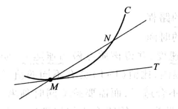
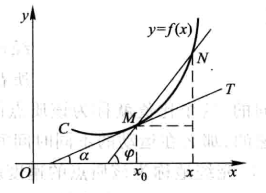

# 1. 导数定义

- 在某点可导的定义

    > 设函数$y=f(x)$在点$x_0$的某个邻域内有定义，当自变量$x$在$x_0$处获得增量$\Delta x$，$x+\Delta x$仍在定义域内。相应的，因变量$y$取得增量$\Delta y = f(x_0 + \Delta x) - f(x_0)$，==如果当$\Delta x$趋于$0$时，$\Delta y$与$\Delta x$之比的极限存在==，则称函数$y=f(x)$在$x_0$处可导，该极限值为函数$y=f(x)$在$x_0$处的导数，记为$f^{\prime}(x_0)$，或$y^{\prime}|_{x = x_0}$，或$\frac {dy} {dx}\big|_{x = x_0}$，或$\frac {df(x)} {dx}\big|_{x = x_0}$

    > 如果当$\Delta x$趋于$0$时，$\Delta y$与$\Delta x$之比的极限不存在，则称在$x_0$处不可导，如果极限不存在的原因是因为极限趋于无穷，也称函数在点$x_0$处的导数为无穷大

    > $f^{\prime}(x_0) = \displaystyle \lim_{\Delta x \to 0} \frac {f(x_0 + \Delta x) - f(x_0)} {\Delta x} $
    >
    > $f^{\prime}(x_0) = \displaystyle \lim_{h \to 0} \frac {f(x_0 + h) - f(x_0)} {h} $
    >
    > $f^{\prime}(x_0) = \displaystyle \lim_{x \to x_0} \frac {f(x) - f(x_0)} {x - x_0} $

- 在开区间可导的定义

    > 如果函数$y=f(x)$在开区间$I$内处处可导，则称函数$y=f(x)$在开区间$I$内可导
    >
    > 在此区间内的每一个$x$，都对应函数$f(x)$的一个导数值，这样构成了一个新函数，称为原函数的导函数，记为$f^{\prime}(x)$，或$y^{\prime}(x)$，或$\frac {dy} {dx}$，或$\frac {df(x)} {dx}$

    > $f^{\prime}(x) = \displaystyle \lim_{\Delta x \to 0} \frac {f(x+ \Delta x) - f(x)} {\Delta x} $
    >
    > $f^{\prime}(x) = \displaystyle \lim_{h \to 0} \frac {f(x+ h) - f(x)} {h} $

- 在闭区间可导的定义

    - 函数$f(x)$在$x_0$处可导的充要条件是

        > 左极限$\displaystyle \lim_{h \to 0^-} \frac {f(x_0 + h) - f(x_0)} {h}$和右极限$\displaystyle \lim_{h \to 0^+} \frac {f(x_0 + h) - f(x_0)} {h}$都存在且相等

        > 左右极限被称为左右导数，记作$f_-^{\prime}(x_0)$和$f_+^{\prime}(x_0)$

    > 如果函数$y=f(x)$在开区间$I$内处处可导，且左端点的右导数，和右端点的左导数都存在，则称函数$y=f(x)$在闭区间$I$上可导

# 2. 导数的几何意义

- 切线

    > 设曲线$C$及$C$上的一点$M$，在点$M$外，另取$C$上一点$N$，做割线$MN$，当点$N$沿着曲线$C$趋于点$M$时，如果割线$MN$绕点$M$旋转而趋于极限位置$MT$，则直线$MT$称为曲线$C$在点$M$处的切线

    > 极限位置的含义是，只要弦长$|MN|$趋近于0，$\angle NMT$也趋于0

    

- 坐标系下的切线

    > 设曲线$C$为$y=f(x)$，设$M(x_0, y_0)$是曲线上一点，另取$C$上一点$N(x, y)$，割线$MN$的斜率为$tan\varphi = \frac {y - y_0} {x - x_0} = \frac {f(x) - f(x_0)} {x - x_0}$，$\varphi$为割线$MN$的倾角
    >
    > 当点$N$沿着曲线$C$趋近于$M$时，$x \to x_0$
    >
    > 如果当$x \to x_0$时$tan\varphi$存在，设为$k$，即，$k = \displaystyle \lim_{x \to x_0}\frac {f(x) - f(x_0)} {x - x_0}$存在，则$k$是切线的斜率，此时$\varphi \to \alpha$，$\alpha$是切线的倾角

    

- 导数的几何意义

    > 函数$y=f(x)$在点$x_0$处的导数$f^{\prime}(x_0)$在几何上表示为曲线$y=f(x)$在点$M(x_0, y_0)$处切线的斜率，即$f^{\prime}(x_0) = tan\alpha$

    > 过切点$M(x_0, y_0)$且与切线垂直的直线，叫做曲线$y=f(x)$在点$M$处的法线，如果$f^{\prime}(x_0)$不为$0$，则法线的斜率为$-\frac {1} {f^{\prime}(x_0)}$

# 3. 可导性和连续性的关系

> 函数在某点可导，则必在该点连续
>
> 函数在某点连续，则未必在该点可导

在某点连续，需要三个条件： ①函数在该点有定义②当$x \to x_0$时函数极限存在③极限和函数值相等

在某点可导，充要条件是左右导数，也即左右极限，存在且相等

需要注意的是，二者中的极限形式不同

- 连续的极限，是$\displaystyle \lim_{x \to x_0}f(x)-f(x_0) = 0$
- 可导的极限，是$\displaystyle \lim_{x \to x_0}\frac {f(x) - f(x_0)} {x - x_0}$

