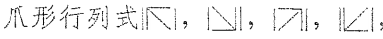

# 1. 排列、逆序与对换

- 排列

    > 由$1,2,3, \cdots, n$的$n$个数字组成的一个有序数列，叫做$n$级排列

    - 其中，按照数字大小正序排序的排列，称为$n$级标准排列

    - $n$级排列的数量

        >  对于$n$级排列，总共有$n!$种

- 逆序

    > 在一个$n$级排列$i_1i_2i_3 \cdots i_n$中，如果一个较大的数$i_s$排在一个较小的数$i_t$前，则称$i_s$和$i_t$构成了一个逆序；
    >
    > 换言之，由于$n$级标准排列是正序的，所以，可以说，如果$n$个数的任意排列中，某对元素的顺序和标准排序不同，则构成了一个逆序

    > 一个排列的所有逆序的总数，称之为逆序数，记为$N$或者$\tau$
    >
    > 逆序数为奇数的，称为奇排列；偶数的，称为偶排列

    > 计数方法：
    >
    > - 往后比
    >     - 从第一个数字开始，在其后面查找比该数字==小==的数字的个数
    >     - 再考虑第二个，以此类推
    > - 往前比
    >     - 从第一个数字开始，在其前面查找比该数字==大==的数字的个数
    >     - 再考虑第二个，以此类推

- 对换

    > 在一个$n$级排列中，互换两个数字的位置，其余数字不动，得到一个新的排列，这样的互换称为一次对换

    > 一个排列经过一次对换后，奇偶性改变

    > $n$级排列共有$n!$个，其中奇排列和偶排列各有$\frac {n!} {2}$个

# 2. 二阶、三阶行列式

- 二阶行列式

    > 四个数$a_{11},\; a_{12},\;a_{21}, \;a_{22}$排成两行两列，两边加竖线，即$\begin{vmatrix} a_{11} & a_{12} \\a_{21} & a_{22} \end{vmatrix}$，称为二阶行列式，它表示一个数，定义为$\begin{vmatrix} a_{11} & a_{12} \\a_{21} & a_{22} \end{vmatrix} = a_{11}\cdot a_{22} - a_{12} \cdot a_{21}$

- 三阶行列式

    > 九个数$a_{ij},\; i,j \in {1,2,3}$排成三行三列，两边加竖线，即$\begin{vmatrix} a_{11} & a_{12} & a_{13} \\a_{21} & a_{22} & a_{23} \\ a_{31} & a_{32} & a_{33} \end{vmatrix}$，称为三阶行列式，它表示一个数，定义为$\begin{vmatrix} a_{11} & a_{12} & a_{13} \\a_{21} & a_{22} & a_{23} \\ a_{31} & a_{32} & a_{33} \end{vmatrix} = a_{11}a_{22}a_{33}+a_{12}a_{23}a_{31}+a_{13}a_{21}a_{32} - a_{13}a_{22}a_{31}- a_{12}a_{21}a_{33}- a_{11}a_{32}a_{23}$

- 对角线分类

    - 主对角线，指的是，从左上到右下的对角线
    - 副对角线，指的是，从右上到左下的对角线

- 对角线法则

    - 对于二阶/三阶行列式，其计算公式可以用对角线法则进行处理，主对角线方向是正号，副对角线方向是负号

        

    - 请注意：<u>对角线法则无法用于四阶或者更高阶的行列式</u>

# 3. $n$阶行列式

- $n$阶行列式

    > 由$n^2$个数$a_{ij}\; i,j \in {1,2,3 \cdots, n}$排成$n$行$n$列，两边加竖线，即$\begin{vmatrix} a_{11} & a_{12} & \cdots & a_{1n} \\ a_{21} & a_{22} & \cdots & a_{2n} \\ \vdots & \vdots & \ddots & \vdots \\ a_{n1} & a_{n2} & \cdots & a_{nn}\end{vmatrix}$

    > 称为$n$阶行列式，记为$|a_{ij}|_{n \times n}$，或$det(a_{ij})$

    - 数字$a_{ij}$称为元素或元，其中，$i$表示的是行号，$j$表示的是列号

    - 左上到右下为主对角线，右上到左下是副对角线

- $n$阶行列式的展开式
    - 行列式表示的是一个数值，$n$阶行列式可通过展开式进行计算，得到该值
    
    - 展开式特点
        - 展开式为$n!$项的代数和
        - 每项为位于不同行不同列的$n$个元素的乘积
        - 每项的正负号由行标排列的逆序数和列标排列的逆序数决定
        
    - 行标自然排列展开式
    
        > $\begin{vmatrix} a_{11} & a_{12} & \cdots & a_{1n} \\ a_{21} & a_{22} & \cdots & a_{2n} \\ \vdots & \vdots & \ddots & \vdots \\ a_{n1} & a_{n2} & \cdots & a_{nn}\end{vmatrix} = \displaystyle \sum_{j_1j_2\dots j_n}(-1)^{N(j_1j_2\dots j_n)}a_{1j_1}a_{2j_2}\cdots a_{nj_n}$
    
    - 列标自然排列展开式
    
        > $\begin{vmatrix} a_{11} & a_{12} & \cdots & a_{1n} \\ a_{21} & a_{22} & \cdots & a_{2n} \\ \vdots & \vdots & \ddots & \vdots \\ a_{n1} & a_{n2} & \cdots & a_{nn}\end{vmatrix} = \displaystyle \sum_{i_1i_2\dots i_n}(-1)^{N(i_1i_2\dots i_n)}a_{i_11}a_{i_22}\cdots a_{i_nn}$
    
    - 非自然排列展开式
    
        > $\begin{vmatrix} a_{11} & a_{12} & \cdots & a_{1n} \\ a_{21} & a_{22} & \cdots & a_{2n} \\ \vdots & \vdots & \ddots & \vdots \\ a_{n1} & a_{n2} & \cdots & a_{nn}\end{vmatrix} = \displaystyle \sum_{i_1i_2\dots i_n}(-1)^{N(j_1j_2\dots j_n) + N(i_1i_2\dots i_n)}a_{i_1j_1}a_{i_2j_2}\cdots a_{i_nj_n}$

# 4. 行列式的性质

- 行列式的某行全部为$0$，或者某列全部为$0$，则该行列式的值为$0$

- 特殊行列式

    - 三角行列式

        - 上三角行列式
            - 指的是==主==对角线下方元素全部为$0$的行列式
            - $|a_{ij}|_n = a_{11}a_{22}\cdots a_{nn}$
        - 下三角行列式
            - 指的是==主==对角线上方的元素全部为$0$
            - $|a_{ij}|_n = a_{11}a_{22}\cdots a_{nn}$
        - 斜上三角行列式
            - 指的是==副==对角线下方元素全部为$0$的行列式
            - $|a_{ij}|_n = (-1)^{\frac {n(n-1)} {2}}a_{1n}a_{2(n-1)}a_{3(n-2)}\cdots a_{n1}$
        - 斜下三角行列式
            - 指的是==副==对角线上方元素全部为$0$的行列式
            - $|a_{ij}|_n = (-1)^{\frac {n(n-1)} {2}}a_{1n}a_{2(n-1)}a_{3(n-2)}\cdots a_{n1}$

    - 对角行列式
        - 主对角行列式
            - 主对角线上下方都是$0$

            - $|a_{ij}|_n = a_{11}a_{22}\cdots a_{nn}$

        - 副对角行列式
            - 副对角线上下方都是$0$

            - $|a_{ij}|_n = (-1)^{\frac {n(n-1)} {2}}a_{1n}a_{2(n-1)}a_{3(n-2)}\cdots a_{n1}$

- 转置行列式$D^T$

    > 将$n$阶行列式$D=\begin{vmatrix} a_{11} & a_{12} & \cdots & a_{1n} \\ a_{21} & a_{22} & \cdots & a_{2n} \\ \vdots & \vdots & \ddots & \vdots \\ a_{n1} & a_{n2} & \cdots & a_{nn}\end{vmatrix}$的行列互换后，所得到的新行列式称为$D$的转置行列式，记为$D^T= \begin{vmatrix} a_{11} & a_{21} & \cdots & a_{n1} \\ a_{12} & a_{22} & \cdots & a_{n2} \\ \vdots & \vdots & \ddots & \vdots \\ a_{1n} & a_{2n} & \cdots & a_{nn}\end{vmatrix}$

    - $D$和$D^T$互为转置行列式
    - 行列式的行列互换，行列式的值不变，即$D=D^T$

- 行列式的性质

    - 性质$1$
        - 行列式的行列互换，行列式的值不变，即$D=D^T$
    - 性质$2$
        - 交换行列式的两行或者两列，行列式的值==改变符号==
            - 推论：行列式如果有两行或者两列，对应的元素相等，则行列式的值为$0$
    - 性质$3$
        - 用常数$k$乘以行列式的某行或者某列，等同于用常数$k$直接乘以行列式本身
            - 推论$1$：若行列式的某行或者某列的所有元素存在公因子，则可以将该公因子提到行列式外边
            - 推论$2$：若行列式的某两行或者某两列的元素对应成比例，也即某行是另一行，某列是另一列，的若干倍，该行列式的值为$0$
    - 性质$4$
        - 若行列式的某行，或者某列的各元素都是两个数的和，那么可以将该行列式拆成两个行列式的和，这两个行列式分别以这两个数之一作为所在行或列的对应位置的元素，其余位置的元素不变
            - 可以推广到某行或列的各元素为$m$个数相加的和的情形
    - 性质5
        - 将行列式某行或列的所有元素同时乘一个常数$k$并加到另外一行或列对应位置的元素上，得到新行列式，与原行列式的值相同
            - 可通过性质$4$和性质$3$的推论$2$证明

- 范德蒙德行列式

    - $\begin{vmatrix} 1 & 1 & 1 & \cdots & 1 \\ x_1 & x_2 & x_3 & \cdots & x_n \\ x_1^2 & x_2^2 & x_3^2 & \cdots & x_n^2 \\ \vdots & \vdots & \vdots & \ddots & \vdots\\ x_1^{n-1} & x_2^{n-1} & x_3^{n-1} & \cdots & x_n^{n-1} \end{vmatrix} = \displaystyle \prod_{1 \le j < i \le n}(x_i - x_j)$
    - 连乘展开共有$\frac {n(n-1)} {2}$项

# 5. 行列式按一行(列)展开

- 余子式和代数余子式

    > - 余子式
    >     - 在$n$阶行列式$D=|a_{ij}|$中，将元素$a_{ij}$所在的第$i$行和第$j$列划掉后，剩余的元素按照原来相对位置构成的$n-1$阶行列式，称为$D$中元素$a_{ij}$的余子式，记为$M_{ij}$
    >
    > - 代数余子式
    >     - $(-1)^{i+j}M_{ij}$称为元素$a_{ij}$的代数余子式，记为$A_{ij}$

- 行列式按一行(列)展开

    > $n$阶行列式$D=|a_{ij}|$等于它的任一行或列的各元素与其代数余子式的和，也即
    >
    > - 按行展开
    >
    >     > $D = a_{i1}A_{i1}+a_{i2}A_{i2}+a_{i3}A_{i3}+ \cdots +a_{in}A_{in}$
    >
    > - 按列展开
    >
    >     > $D = a_{1j}A_{1j}+a_{2j}A_{2j}+a_{3j}A_{3j}+ \cdots +a_{nj}A_{nj}$

- 异乘变零定理

    > 在$n$阶行列式$D=|a_{ij}|$的某一行或列的所有元素，与另一行或列中，对应元素的代数余子式的乘积的和，等于0

# 6. 行列式按多行(列)展开

- $k$阶子式的余子式和代数余子式

    > - $k$阶子式
    >
    >     - 在$n$阶行列式$D=|a_{ij}|$中，任意选取$k$行$k$列，位于这些行列交叉点的$k^2$个元素，按照原来的相对位置构成的$k$阶行列式，称为$D$的一个$k$阶子式
    >
    > - $k$阶子式的余子式
    >
    >     - 在$n$阶行列式$D=|a_{ij}|$中，划去$k$阶子式$N$所在的行和列后，剩余元素按照原来相对位置不变得到的$n-k$阶行列式$M$，称$M$为$N$的余子式
    >
    > - $k$阶子式的代数余子式
    >
    >     - 设行列式$D$的$k$阶子式$N$所在的行标为$i_1,i_2,\dots,i_k$，列标为$j_1,j_2,\dots,j_k$，则称$A=(-1)^{(i_1+i_2+\dots+i_k) + (j_1+j_2+\dots+j_k)}M$
    >
    >         为$N$的代数余子式，其中$M$为$N$的余子式

- 行列式按$k$行(列)展开

    - 拉普拉斯定理

        > 在$n$阶行列式$D$中，任意取定$k$行或者$k$列，则由这$k$行或列元素，所组成的一切$k$阶子式$N_1, N_2,\dots, N_t(t=C_n^k)$与他们对应的代数余子式$A_1, A_2,\dots,A_t$的乘积之和，等于行列式$D$，也即
        >
        > $D = N_1A_1 + N_2A_2 + N_3A_3 + \cdots + N_tA_t$

    - 特殊行列式应用拉普拉斯定理

        - 设$A$为$m$阶行列式，$B$为$n$阶行列式，$O$为全部为$0$的行列式，易知$O$为$n$行$m$列

            > $\begin{vmatrix} A & C \\ O & B\end{vmatrix} = \begin{vmatrix} A & O \\ C & B\end{vmatrix}=\begin{vmatrix} A & O \\ O & B\end{vmatrix} = |A||B|$

            > $\begin{vmatrix} O & A \\ B & C\end{vmatrix} = \begin{vmatrix}C & A \\ B & O\end{vmatrix}=\begin{vmatrix} O & A \\ B & O\end{vmatrix} = (-1)^{mn}|A||B|$

# 7. 行列式的计算

- 计算方法

    1. 利用行列式定义进行计算

        多限于计算简单行列式，或零元素较多并具有一定排列规律的行列式

    2. 利用行列式的性质进行计算

        常用行列式的性质，将行列式化为上/下三角行列式，然后计算

    3. 利用按照行或列展开进行计算

- 化三角形法

    - 如果行列式的每行，或者每列，的元素之和都相等，可以将其他行列的元素加到第一行/列，然后提取公因子，则第一行/列转换为$1$，再继续化简行列式
    - 计算$n$阶行列式$D = \begin{vmatrix} a & b & b & \cdots & b \\ b & a & b & \cdots & b \\ b & b & a & \cdots & b \\ \vdots & \vdots & \vdots & \ddots & \vdots \\ b & b & b & \cdots & a\end{vmatrix}$

        

- 爪型行列式

    - 如果行列式如下，则可以考虑将行或列的元素化为$0$，转化为三角行列式

        
    - 计算行列式$D = \begin{vmatrix} 1 & 1 & 1 & \cdots & 1 \\ 1 & -2 & 0 & \cdots & 0 \\ 1 & 0 & -3 & \cdots & 0\\ \vdots & \vdots & \vdots & \ddots & \vdots \\ 1 & 0 & 0 & \cdots & -n \end{vmatrix}$

        
    - 计算行列式$D =\begin{vmatrix} 1 + a_1 & 1 & 1 & \cdots & 1 \\ 1 & 1 + a_2 & 1 & \cdots & 1\\ 1 & 1 & 1 + a_3 & \cdots & 1\\ \vdots & \vdots & \vdots & \ddots & \vdots \\ 1 & 1 & 1 & \cdots & 1 + a_n \end{vmatrix} $

        

- 递推法

    - 如果$n$阶行列式$D_n$可以表达为比其低一阶的行列式$D_{n-1}$的表达式，则可以使用递推法
    - 计算行列式$D_n = \begin{vmatrix} x & -1 & 0 & \cdots & 0 &0 \\ 0 & x & -1 & \cdots & 0 & 0 \\ 0 & 0 & x & \cdots & 0 & 0 \\ \vdots & \vdots & \vdots & \ddots & \vdots & \vdots \\ 0 & 0& 0& \cdots & x & -1 \\ a_n & a_{n-1} & a_{n-2} & \cdots & a_2 & x +a_1\end{vmatrix}$

        

- 数学归纳法

    - 证明范德蒙德行列式$\begin{vmatrix} 1 & 1 & 1 & \cdots & 1 \\ x_1 & x_2 & x_3 & \cdots & x_n \\ x_1^2 & x_2^2 & x_3^2 & \cdots & x_n^2 \\ \vdots & \vdots & \vdots & \ddots & \vdots\\ x_1^{n-1} & x_2^{n-1} & x_3^{n-1} & \cdots & x_n^{n-1} \end{vmatrix} = \displaystyle \prod_{1 \le j < i \le n}(x_i - x_j)$

        

- 拉普拉斯定理展开
- 升阶法

    - 通过在原行列式上新添加第一行和第一列，在保证行列值不变的前提下简化运算，需要确保添加的行列与原行列式中的行列没有线性关系，否则新行列式的值为$0$

    - 计算行列式$D = \begin{vmatrix} x_1^2+1 & x_1x_2 & \cdots & x_1x_n \\ x_2x_1 & x_2^2+1 & \cdots & x_2x_n \\ \vdots & \vdots & \ddots & \vdots \\ x_nx_1 & x_nx_2 & \cdots & x_n^2 +1 \end{vmatrix}$

        

# 8. 克莱姆法则

- 克莱姆法则用于求解$n$元线性方程组

    > 含有$n$个方程，$n$个未知数的$n$元线性方程组$\begin{cases}
    > a_{11}x_1 + a_{12}x_2 + \cdots + a_{1n}x_n = b_1 \\
    > a_{21}x_1 + a_{22}x_2 + \cdots + a_{2n}x_n = b_2 \\
    > \vdots \\
    > a_{n1}x_1 + a_{n2}x_2 + \cdots + a_{nn}x_n = b_n
    > \end{cases}$
    >
    > 当系数行列式$D = \begin{vmatrix}
    > a_{11} & a_{12} & \cdots & a_{1n} \\
    > a_{21} & a_{22} & \cdots & a_{2n} \\
    > \vdots & \vdots & \ddots & \vdots \\
    > a_{n1} & a_{n2} & \cdots & a_{nn}
    > \end{vmatrix}$不等于$0$时，方程组有唯一解，且唯一解为$x_1 = \frac {D_1} {D}, x_2 = \frac {D_2} {D},x_3 = \frac {D_3} {D}, \cdots, x_n = \frac {D_n} {D}$
    >
    > 其中$D_i$是用方程组等式右侧的$b_i$值，替换对应第$i$列的行列式，如，$D_2= \begin{vmatrix} a_{11} & b_1 & a_{13} & \cdots & a_{1n} \\ a_{21} & b_2 & a_{23} & \cdots & a_{2n} \\ \vdots & \vdots & \vdots & \ddots & \vdots \\ a_{n1} & b_n & a_{n3} & \cdots & a_{nn} \end{vmatrix}$

    - 前提：
        - 未知数个数，和方程个数相同
        - 系数的行列式的值不为$0$

- 
