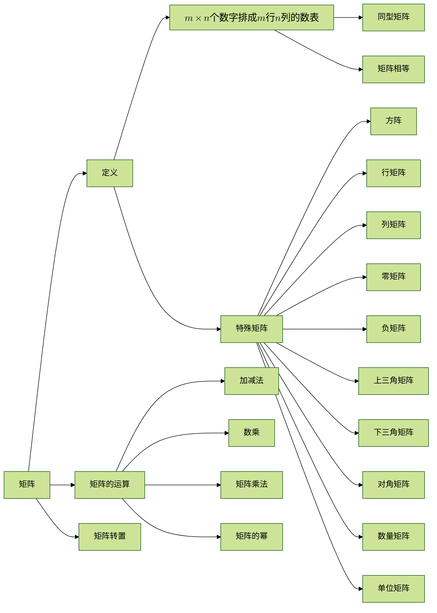

```mermaid
%%{init: {'theme':'forest'}}%%
flowchart LR
	matrix[矩阵] --> definition[定义]
		definition[[定义]] --> D["$$m \times n 个数字排成m行n列的数表$$"]
            D --> 同型矩阵
            D --> 矩阵相等
        definition[定义] --> 特殊矩阵
        	特殊矩阵 --> 方阵
        	特殊矩阵 --> 行矩阵
        	特殊矩阵 --> 列矩阵
        	特殊矩阵 --> 零矩阵
        	特殊矩阵 --> 负矩阵
        	特殊矩阵 --> 上三角矩阵
        	特殊矩阵 --> 下三角矩阵
        	特殊矩阵 --> 对角矩阵
        	特殊矩阵 --> 数量矩阵
        	特殊矩阵 --> 单位矩阵
    matrix[矩阵] --> calculate[矩阵的运算]
    	calculate[矩阵的运算] --> pm[加减法]
    	calculate[矩阵的运算] --> kmul[数乘]
    	calculate[矩阵的运算] --> mul[矩阵乘法]
    	calculate[矩阵的运算] --> pow[矩阵的幂]
    matrix[矩阵] --> transpose[矩阵转置]
    
```

