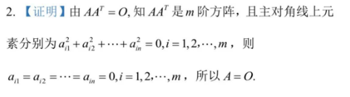

# 1. 矩阵的概念

## 1.1 矩阵的概念

> 矩阵：$m \times n$个数$a_{ij}(\; i = 1,2,3,\cdots,m; j = 1,2,3,\cdots,n)$排列成一个$m$行$n$列的数表，称为一个$m \times n$矩阵

> 同型矩阵：矩阵$A$和矩阵$B$是同型矩阵$\Leftrightarrow$矩阵$A$和矩阵$B$的行数相等，列数也相等

> 矩阵相等：矩阵$A$和矩阵$B$相等$\Leftrightarrow$$A=B$$\Leftrightarrow \begin{cases} &A\text{和}B\text{是同型矩阵；}\\&\text{对应位置元素相等} \end{cases}$

## 1.2 特殊矩阵

- 方阵
    - 行数和列数相等的矩阵，相等的行列数称为阶数
        - $\begin{bmatrix} 1 & 2 \\ 3 & 4 \end{bmatrix}$
- 行矩阵
    - 只有一行的矩阵，也称为行向量
        - $\begin{bmatrix} 1 & 2\end{bmatrix}$
- 列矩阵
    - 只有一列的矩阵，也称为列向量
        - $\begin{bmatrix} 1 \\ 3 \end{bmatrix}$
- 零矩阵
    - 元素全为$0$的矩阵
        - $\begin{bmatrix} 0 & 0 & 0 \\ 0 & 0 & 0 \end{bmatrix}$
- 负矩阵
    - 将矩阵$A$的所有元素取其对应相反数后得到的矩阵，叫做$A$的负矩阵，记为$-A$
        - $A=\begin{bmatrix} 1 & 2 \\ 3 & 4 \end{bmatrix}$，则$-A = \begin{bmatrix} -1 & -2 \\ -3 & -4 \end{bmatrix}$
- 上三角矩阵
    - 主对角线下方的元素全部为$0$的==方阵==
- 下三角矩阵
    - 主对角线上方的元素全部为$0$的==方阵==
- 对角矩阵
    - 即使上三角矩阵，又是下三角矩阵，也即主对角线上方，下方元素全部为$0$的==方阵==
        - 主对角线元素可以是$0$
    - 记为$diag(a_1, a_2, \dots,a_n)$
- 数量矩阵
    - 主对角线元素是同一个常数的==对角矩阵==，记为$kE$
        - $E_n = \begin{bmatrix} k\\ & k \\ & & k \\&&&\ddots \\ &&&& k\end{bmatrix}$
- 单位矩阵
    - 主对角线元素全为==$1$==，其他位置元素全为$0$的==方阵==，记为$E$
        - $n$阶单位矩阵
        - $E_n = \begin{bmatrix} 1\\ & 1 \\ & & 1 \\&&&\ddots \\ &&&&1\end{bmatrix}$

# 2. 矩阵的加法、减法、数乘

## 2.1 矩阵的加减法

> 两个同型矩阵相加，就是==对应位置==的元素相加

> 两个同型矩阵相减，就是==对应位置==的元素相减

- 加减法运算规律
    - $A+B = B+A$
    - $(A+B)+C = A + (B+C)$
    - $A+O = A$
    - $A+(-A)= O$
    - $A-B=A+(-B)$
    - $A + B = C \Leftrightarrow A=C-B$

## 2.2 矩阵的数乘

> 数$k$乘以矩阵$A$，就是用数$k$乘以矩阵$A$里的每个元素

- 注意与行列式数乘的区别
    - 行列式是将某一行/列的公因子提到外边一次
    - 矩阵是将所有元素的公因子提到外边一次

- 运算规律
    - $k(A+B) = kA+kB$
    - $(k+l)A=kA+lA$
    - $k(lA) = (kl)A$
    - $1A = A$
    - $(-1)A = -A$

# 3. 矩阵的乘法

> 两个矩阵$A$、$B$，如果$A$的列数，等于$B$的行数，则$A$、$B$可以相乘得到一个新的乘积矩阵$AB$，乘法规则定义如下：
>
> 设$A = \begin{bmatrix} a_{11} & a_{12} & \cdots & a_{1n} \\ a_{21} & a_{22} & \cdots & a_{2n} \\ \vdots & \vdots & \ddots & \vdots \\ a_{m1} & a_{m2} & \cdots & a_{mn}\end{bmatrix}_{\textcolor{red}{m \times n}}$，$B = \begin{bmatrix} b_{11} & b_{12} & \cdots & b_{1s} \\ b_{21} & b_{22} & \cdots & b_{2s} \\ \vdots & \vdots & \ddots & \vdots \\ b_{n1} & b_{n2} & \cdots & b_{ns}\end{bmatrix}_{\textcolor{red}{n \times s}}$，则乘积矩阵$AB = \begin{bmatrix} c_{11} & c_{12} & \cdots & c_{1s} \\ c_{21} & c_{22} & \cdots & c_{2s} \\ \vdots & \vdots & \ddots & \vdots \\ c_{m1} & c_{m2} & \cdots & c_{ms}\end{bmatrix}_{\textcolor{red}{m \times s}}$
>
> 其中，$c_{ij} = a_{i1}b_{1j} + a_{i2}b_{2j} + \cdots + a_{in}b_{nj},\; i = 1,2,3,\cdots,m; j= 1,2,3,\cdots,s $

> 1. 只有左边矩阵的列数，等于右边矩阵的行数时，才能相乘
> 2. 乘积矩阵的行数，等于左边矩阵的行数，乘积矩阵的列数，等于右边矩阵的列数
> 3. 乘积矩阵的元素，等于左边矩阵的行，乘以右边矩阵的列
>     - 乘积矩阵的第$i$行，第$j$列元素，等于左边矩阵的第$i$行，和右边矩阵的第$j$列元素对应相乘求和

## 3.1 矩阵乘法==不满足==的规律

- 矩阵的乘法==不满足交换律==
    - 当$AB$，$BA$都有意义时，$AB$，$BA$不一定相等
    - $AB$有意义，$BA$不一定有意义
- 矩阵的乘法==不满足消去律==
    - 若$AB=AC$，且$A\ne O$，推到不出$B=C$
    - 若$BA=CA$，且$A\ne O$，推到不出$B=C$
- 两个非零矩阵的乘积可能是零矩阵
    - 若$AB=O$，推到不出$A=O$或$B=O$
- 第二点和第三点的例子
    - 矩阵$A=\begin{bmatrix} 1 & 0 \\ 2& 0 \end{bmatrix}$，$B=\begin{bmatrix} 0 & 0 \\ 1 & 2 \end{bmatrix}$，$C=\begin{bmatrix} 0 & 0 \\ 2 & 3 \end{bmatrix}$
        - 则$AB = AC =  \begin{bmatrix} 0 & 0 \\ 0 & 0 \end{bmatrix}$，且$A \ne 0$，但是$B \ne C$
        - 则$AB = \begin{bmatrix} 0 &  0 \\ 0 &  0 \end{bmatrix}$，但是$A \ne 0, B\ne 0$

## 3.2 矩阵乘法==满足==的规律或性质

- 结合律
    - $(AB)C = A(BC)$
- 分配律 *<u>注意$C$的左右位置不能动</u>*
    - $(A+B)C = AC + BC$
    - $C(A+B) = CA +CB$
- 数乘与矩阵乘积
    - $k(AB)=(kA)B=A(kB)$
- 单位矩阵与矩阵相乘  *<u>单位矩阵在矩阵乘法中相当于数乘$1$</u>*
    - $AE = EA = A$
- 数量矩阵与矩阵相乘  *<u>数量矩阵在矩阵乘法中相当于数乘</u>*
    - 数量矩阵$A= \begin{bmatrix} a & 0 & \cdots & 0\\ 0 & a & \cdots & 0 \\ \vdots & \vdots & \ddots & \vdots  \\ 0 & 0 & \cdots & a\end{bmatrix} = aE$，则有$AB = aB$
- 两个对角矩阵相乘
    - $\begin{bmatrix} a_1\\ & a_2 \\ & & a_3 \\&&&\ddots \\ &&&& a_n\end{bmatrix} \begin{bmatrix} b_1\\ & b_2 \\ & & b_3 \\&&&\ddots \\ &&&& b_n\end{bmatrix} = \begin{bmatrix} a_1b_1\\ & a_2b_2 \\ & & a_3b_3 \\&&&\ddots \\ &&&& a_nb_n\end{bmatrix}$
- 行列向量相乘  <u>*顺序不同结果不同*</u>
    - 行向量乘以列向量，结果是一个==常数==
    - 列向量乘以行向量，结果是一个==矩阵==
    - 若方阵$A$的==任意两行(列)对应成比例==，则方阵$A$可表示为$ \begin{bmatrix} *\\ * \\ \vdots \\ *\end{bmatrix}  \begin{bmatrix} * & * & \cdots & *\end{bmatrix}$
        - 可以选取矩阵的某个首元$a_{1i}$不为$0$的列向量$\alpha$，再选取某个行列向量，并用$a_{1i}$除以该行向量，得到新行向量$\beta^T$，则方阵可化为$\alpha \beta^T$

## 3.3 矩阵的可交换

> 若矩阵$A$，$B$，满足$AB=BA$，则称$A$和$B$可交换，否则为不可交换

> 可交换的矩阵，一定满足：
>
> - 一定是==同阶方阵==
>     - 不是同阶方阵一定不是可交换矩阵
> - $AB=BA$
>     - $AB$，$BA$不相等，一定不是可交互矩阵

> 单位矩阵$E$，和任一个同阶方阵可交换

> 两个同阶对角矩阵可交换

# 4. 方阵的幂

## 4.1 方阵的幂的定义

> 设$A$为==方阵==，$k$为正整数，则$A$的$k$次幂的定义为：
>
> $A^k = \underbrace{A \cdot A \cdot \cdots \cdot A}_{k \text{ 个}}$
>
> 规定： $A^0 = E$

- 只有方阵才有幂！

## 4.2 方阵的幂的性质

- 设$A$为方阵，$k_1,k_2$为非负整数，则有

    - $A^{k_1}A^{k_2} = A^{k_1+k_2}$
    - $(A^{k_1})^{k_2} = A^{k_1k_2}$

- $(lA)^k = l^kA^k, l\text{为常数},\;k\text{为正整数}$

- 若矩阵$A$，$B$可交换，则有

    > 若$A,B$不可交换，则该项内容等式==均不成立==

    - $A^2-B^2 = (A-B)(A+B) = (A+B)(A-B)$
    - $(A+B)^2 = A^2 +2AB +B^2$
    - $(A-B)^2 = A^2 -2AB +B^2$
    - $(A-B)^3 = (A-B)(A^2 +AB +B^2)$
    - $(A+B)^3 = (A+B)(A^2 -AB +B^2)$
    - $(AB)^k = A^kB^k$

- 一般有，不要求矩阵$A$，$B$可交换

    - $(A+B)(A-B) = A^2 + BA - AB - B^2$
    - $(A+B)^2 = A^2 +AB +BA +B^2$
    - $(A-B)^2 = A^2 - AB -BA +B^2$

- 方阵多项式

    - 设$f(x) = a_mx^m + a_{m-1}x^{m-1} + \cdots + a_1x + a_0$，则有

        $f(A) = a_mA^m + a_{m-1}A^{m-1} + \cdots + a_1A + \textcolor{red}{a_0E}$

# 5. 矩阵的转置

## 5.1 转置定义

> 将矩阵$A$的各行依次变为列(或各列依次变为行)后得到的矩阵，即为$A$的转置矩阵$A^T$
>
> > $A$和$A^T$互为转置矩阵
> >
> > 若$A$为$m \times n$矩阵，则$A^T$为$n \times m$矩阵

- 转置矩阵性质

    - $(A^T)^T = A$
    - $(A+B)^T = A^T + B^T$
    - $(A-B)^T = A^T - B^T$
    - $(kA)^T = kA^T$
    - $(AB)^T = B^TA^T$
        - 可以推广到$m$个矩阵积的转置矩阵
        - $(A_1A_2\cdots A_m)^T = A_m^T \cdots A_2^TA_1^T$

    - $(A^k)^T = (A^T)^k$

## 5.2 对称矩阵与反对称矩阵

- 对称矩阵  *<u>必为方阵</u>*

    > 如果矩阵$A$满足$A = A^T$，则称矩阵$A$为对称矩阵
    >
    > 也即，第$i$行等于第$i$列

    > 设矩阵$A$为$n$阶方阵，$A = (a_{ij})_{n \times n}$，若$a_{ij} = a_{ji}\;i = 1,2,3,\cdots,n;\;j = 1,2,3,\cdots,n$，则称矩阵$A$为对称矩阵

    - 对称矩阵的性质

        - 若$A$，$B$为同阶对称矩阵，则$A+B$，$A-B$仍为对称矩阵

        - 若$A$为对称矩阵，则$kA$，$A^m$仍为对称矩阵，$k$为常数，$m$为正整数

        - 若$A$，$B$为同阶对称矩阵，则$AB$为对称矩阵的==充要条件==是$AB=BA$

        - 对任意$m \times n$矩阵$A$，则$A^TA, AA^T$均为对称矩阵

            - 若$A$为$m \times n$矩阵，且$AA^T = O$， 则$A = O$

                

- 反对称矩阵  *<u>必为方阵</u>*

    > 如果矩阵$A$满足$A^T = -A$，则称矩阵$A$为反对称矩阵
    >
    > 也即，第$i$行等于第$i$列的相反数

    > 设矩阵$A$为$n$阶方阵，$A = (a_{ij})_{n \times n}$，若$a_{ij} = -a_{ji}\;i = 1,2,3,\cdots,n;\;j = 1,2,3,\cdots,n$，则称矩阵$A$为反对称矩阵

    > ==易知，反对称矩阵的主对角线上的元素均为$0$==
    
    - 反对称矩阵的性质
        - 若$A$，$B$为同阶反对称矩阵，则$A+B$，$A-B$仍为反对称矩阵
        - 若$A$为反对称矩阵，则$kA$仍为对称矩阵，$k$为常数
        - 若$A$为反对称矩阵，$k$为正整数，则$A^k$为$\begin{cases} \text{对称矩阵，}&k\text{偶数}\\  \text{反对称矩阵，}&k\text{奇数}\end{cases}$

# 6. 方阵的行列式

> 做题时，在写矩阵的行列式前，要知道到底是不是方阵

> 设$n$阶方阵$A = \begin{bmatrix} a_{11} & a_{12} & \cdots & a_{1n} \\ a_{21} & a_{22} & \cdots & a_{2n} \\ \vdots & \vdots & \ddots & \vdots \\ a_{n1} & a_{n2} & \cdots & a_{nn}\end{bmatrix}$，则$A$的行列式为$|A|\begin{vmatrix} a_{11} & a_{12} & \cdots & a_{1n} \\ a_{21} & a_{22} & \cdots & a_{2n} \\ \vdots & \vdots & \ddots & \vdots \\ a_{n1} & a_{n2} & \cdots & a_{nn}\end{vmatrix}$
>
> > 矩阵$A$的行列式$|A|$为一个数
> >
> > ==只有方阵才有行列式==

- 方阵行列式的性质
    - $|A^T| = |A^T|=|A|$
    - $|kA| = k^n|A|$
    - $|AB| = |A| \cdot |B|$
        - 该条性质的前提，是$A,B$都是$n$阶方阵，如果是$|A_{2 \times 3}B_{3 \times 2}|$，则不能使用该条性质，因为只有方阵才有行列式，$A_{2 \times 3}$，$B_{3 \times 2}$均不是方阵，但是$A_{2 \times 3}B_{3 \times 2}$是方阵
    - $|A^m| = |A|^m$
    - $|E| = 1$
    - 若$A$是==奇数阶==反对称矩阵，则$|A|=0$

# 7. 方阵的伴随矩阵

> 设$A = (a_{ij})_{n \times n}$， $|A|$中元素$a_{ij}$的代数余子式为$A_{ij}\; (i,j = 1,2,3,\cdots,n)$，则矩阵$A$的伴随矩阵$A^{\ast}$的定义为
>
> $A^{\ast} = \begin{bmatrix} A_{11} & A_{21} & \cdots & A_{n1} \\ A_{12} & A_{22} & \cdots & A_{n2} \\ \vdots & \vdots & \ddots & \vdots \\ A_{1n} & A_{2n} & \cdots & A_{nn}\end{bmatrix}$
>
> > - $A^{\ast}$的元素是$a_{ij}$的代数余子式，是==把行的代数余子式放到列上==
> > - ==有且只有方阵才有伴随矩阵==

- 伴随矩阵的性质

    - 对任意方阵$A$，有$AA^{\ast}= A^{\ast}A = |A|E$

        - 伴随矩阵是行的代数余子式放到列上，再结合异乘变零定理，可证
        - 不论$A$是否可逆，该等式都成立
    
    - 若$A$为$n$阶方阵，则$|A^{\ast}| = |A|^{n-1}$
    
        - $$
            \begin{align*}
            & \text{根据第一个定理可知，}AA^{\ast} = |A|E \\
            & \text{两边取行列式，则有，}|AA^{\ast}| = \big||A|E\big| \\
            & \text{等号左边，根据矩阵行列式的性质有，}|AA^{\ast}| = |A||A^{\ast}|\\
            & \text{等号右边，根据矩阵行列式的性质有，}\big||A|E\big| = |A|^{n}|E| = |A|^{n}\\
            & \text{将上式两边同时除以}|A|\text{，（注意到当}|A|\text{为}0\text{时，性质一定成立）}\\
            & \text{有，}|A^{\ast}| = |A|^{n-1} \\
            & \text{证毕}
            \end{align*}
            $$
    
        - 不论$A$是否可逆，该等式都成立
    
    - 若$𝐴$为方阵，则$(A^T)^{\ast} = (A^{\ast})^T$
    
    - 若$A$为$n$阶方阵，$k$为常数，则$(kA)^{\ast} = k^{n-1}A^{\ast}$
    
        - $(kA)^{\ast}$在计算每个代数余子式时，相比较$A^{\ast}$，每个代数余子式都扩大了$k^{n-1}$倍
    
    - 若$A= \begin{bmatrix} a & b \\ c & d \end{bmatrix}$，则$A^{\ast}= \begin{bmatrix} d & -b \\ -c & a \end{bmatrix}$
    
        - 主对角线位置互换，副对角线取相反数
    
    - 若$A$为$n$阶方阵
    
        - 当$A^{\ast} = A^T$，可推导出元素$a_{ij}$等于其代数余子式$A_{ij}$
        - 当元素$a_{ij}$等于其代数余子式$A_{ij}$，可推导出$A^{\ast} = A^T$
        - 再结合行列式$|A|$等于元素$a_{ij}$和$A_{ij}$的和，可以求出相关题目

# 8. 逆矩阵

> 做题时，在写$A^{-1}$前，要么题干说了$A$可逆，要么自己证明了$|A| \ne 0$

- 定义

    - 逆矩阵

        > 设$A$为$n$阶方阵，若存在$n$阶方阵$B$，使得$AB=BA=E$，则称矩阵$A$是可逆的，且$B$是$A$的逆矩阵，记作$A^{-1}$

        > 若方阵$A$可逆，则其逆矩阵==唯一==，且$AA^{-1} = A^{-1}A = E$

        > 方阵要么有逆矩阵，要么没有逆矩阵

    - 奇异矩阵

        > 设$A$为$n$阶方阵，若$|A| \ne 0$，则称矩阵$A$是非奇异矩阵，若$|A| = 0$，则称$A$是奇异矩阵

- 矩阵可逆的判定

    > 方阵$A$可逆的==充要条件==是$A$为非奇异矩阵，即$|A| \ne 0$，并且当$A$可逆时，$A^{-1} = \frac {1} {|A|}A^{\ast}$
    >
    > > 利用该公式求逆矩阵，称为==伴随矩阵法==

    > 对角矩阵$A=\begin{bmatrix} a_1\\ & a_2 \\ & & a_3 \\&&&\ddots \\ &&&& a_n\end{bmatrix}$可逆的充要条件是$a_1, a_2, \cdots, a_n$==均==不为$0$，且$A^{-1}= \begin{bmatrix} \frac {1}{a_1}\\ & \frac {1}{a_2} \\ & & \frac {1}{a_3} \\&&&\ddots \\ &&&& \frac {1}{a_n}\end{bmatrix}$

    > 设$A$是$n$阶方阵，若存在$n$阶方阵$B$，使得$AB=E$或$BA=E$，则$A$可逆，且$A^{-1}= B$

- 可逆矩阵的性质

    - 若方阵$A$可逆，则其逆矩阵$A^{-1}$也可逆，且$(A^{-1})^{-1} = A$
    - 若方阵$A$可逆，则
        - $A^T$也可逆，且$(A^T)^{-1} = (A^{-1})^T$
        - $A^{\ast}$也可逆，且$(A^{\ast})^{-1} = (A^{-1})^{\ast}= \frac {1} {|A|} A$
        - $k$为非零常数，则$kA$也可逆，且$(kA)^{-1} = \frac 1 k A^{-1}$
        - $m$为正整数，则$A^m$也可逆，且$(A^m)^{-1} = (A^{-1})^m$
    - 若方阵$A$可逆，则
        - $A^{-1} = \frac {1} {|A|}A^{\ast}$
        - $|A^{-1}| = \frac {1} {|A|}$
    - 若$A,B$为同阶可逆矩阵，则$AB$也可逆，且$(AB)^{-1} = B^{-1}A^{-1}$
        - 可推广到有限个同阶方阵的情况，即，$(A_1A_2\cdots A_n)^{-1} = A_n^{-1} \cdots A_2^{-1}A_1^{-1}$

- 解矩阵方程

    > 永远不要把矩阵放到分母上
    
    - 若$A,B$均为可逆矩阵，则矩阵方程，*<u>要注意矩阵乘法的位置</u>*
        - $AX=C$，其解为$X = A^{-1}C$
        - $XA=C$，其解为$X = CA^{-1}$
        - $AXB = C$，其解为$X = A^{-1}CB^{-1}$

# 589. 重要说明

> - 转置与逆，伴随矩阵与逆，转置与伴随矩阵，可以交换顺序，也即
>
>     - $(A^T)^{-1}= (A^{-1})^T$
>
>     - $(A^{\ast})^{-1} = (A^{-1})^{\ast}$
>
>     - $(A^T)^{\ast} = (A^{\ast})^T$
>
> - 矩阵的幂和矩阵的转置，矩阵的幂和逆矩阵，可以交换顺序
>
>     - $(A^T)^m = (A^m)^T$
>     - $(A^m)^{-1}=(A^{-1})^m$

# 9. 矩阵的初等变换

## 9.1 矩阵的初等变换

>  初等变换分为初等行变换和初等列变换

- 初等行变换

    > 矩阵的以下三种变换，称为矩阵的初等行变换
    >
    > - 交换矩阵的两行
    > - 用数$k \ne 0$乘矩阵某行的全部元素
    > - 把矩阵某行的全部元素的$l$倍，加到另一行对应的元素上

- 初等列变换

    > 矩阵的以下三种变换，称为矩阵的初等列变换
    >
    > - 交换矩阵的两列
    > - 用数$k \ne 0$乘矩阵某列的全部元素
    > - 把矩阵某列的全部元素的$l$倍，加到另一列对应的元素上

- 矩阵$A$经过初等变换得到矩阵$B$，记为$A \rightarrow B$

## 9.2 矩阵标准型

- 标准形定义  <u>*不一定是方阵*</u>

    > 标准形矩阵：元素只有$0$和$1$，且矩阵左上角是一个单位矩阵，除此之外的元素都是$0$

- 标准形变换

    > <u>任何矩阵$A$都可以经过初等变换，化为标准形矩阵</u>，并称此标准形矩阵为矩阵$A$的标准形

    - 标准形矩阵中$1$的个数就是矩阵的秩

## 9.3 阶梯形矩阵

- 行阶梯形矩阵

    > 满足下方两个条件的矩阵，称为行阶梯形矩阵
    >
    > - 如果矩阵有零行，则零行都在非零行下方
    > - 任一非零行，从左到右数的第一个非零元素（称为首非零元）所在的列，在这个元素==左下方==（如果有的话）都是零

    > 特别的，若行阶梯形矩阵的==首非零元都是$1$==，且==首非零元所在列中，其他元素都是==$0$，则此矩阵为<u>行简化阶梯形矩阵</u>

- 行阶梯形矩阵变换

    > <u>任何矩阵都可经过若干次初等==行==变换化为行阶梯形矩阵</u>
    >
    > <u>任何矩阵都可经过若干次初等==行==变换化为行简化阶梯形矩阵</u>
    >
    > $\text{矩阵} \stackrel {\text{行变换}} {\longrightarrow} \text{行阶梯形矩阵}\stackrel {\text{行变换}} {\longrightarrow} \text{行简化阶梯形矩阵}$
    
    - 如果==只用==初等行变换，则行阶梯矩阵不是唯一的，但是行简化矩阵一定是唯一的

# 10. 初等矩阵

## 10.1 初等矩阵定义

> 由==单位矩阵==$E$经过**一次**初等行或列变换得到的矩阵，称为初等矩阵

- 类型

    > $E(ij)$： 交换单位矩阵$E$的第$i,j$两行，或两列

    > $E(i(k))$：用非零数$k$乘以单位矩阵$E$的第$i$行或列

    > $E(ij(l))$：把单位矩阵$E$的第$j$行的$l$倍加到第$i$行

## 10.2 初等矩阵的性质

- 初等矩阵的行列式都不为$0$  ==所有都可逆==

    - $E(ij) = -1$      相当于交换了行列式两行或列，改变一次符号

    - $E(i(k))=k$      相当于对角线某个元素扩大了$k$倍

    - $E(ij(l)) = 1$     虽然不是对角行列式，但仍是上三角或下三角行列式
- 初等矩阵的转置矩阵仍是同种类型的初等矩阵
    - $E(ij)^T = E(ij)$
    - $E(i(k))^T = E(i(k))$

    - $E(ij(l))^T=E(j\textcolor{red}{i}(l))$
- 初等矩阵均可逆，且初等矩阵的逆矩阵仍为同种类型的初等矩阵
    - $E(ij)^{-1} = E(ij)$
    - $E(i(k))^{-1} = E(i(\frac 1k))$

    - $E(ij(l))^{-1}= E(ij(\textcolor{red}{-l}))$

## 10.3 初等矩阵与矩阵的初等变换的关系

- 设$A$为$m \times n$阶矩阵，则

    > 对$A$进行一次初等==行==变换，等于用==同种类型==的==$m$==阶初等矩阵==左==乘$A$，也即，用初等矩阵==左==乘$A$，等于对$A$实施一次相对应的初等==行==变换

    > 对$A$进行一次初等==列==变换，等于用==同种类型==的==$n$==阶初等矩阵==右==乘$A$，也即，用初等矩阵==右==乘𝐴，等于对𝐴实施一次相对应的初等==列==变换

# 11. 矩阵的等价$\cong$

- 矩阵等价定义

    > 若矩阵$A$可以经过有限次初等变换化为矩阵$B$，则说$A$与$B$等价，记为$A \cong B$
    >
    > > $A \cong B \Leftrightarrow A \rightarrow B$

    - <u>*等价矩阵一定是同型矩阵*</u>

- 矩阵等价的性质

    - 反身性，对任何矩阵$A$，都有$A \cong A$
    - 对称性，若矩阵$A \cong B$，则$B \cong A$
    - 传递性，若矩阵$A \cong B$，$B \cong A$，则$A \cong C$

- 矩阵等价的结论

    1. 任一个矩阵$A_{m \times n}$都和其标准形矩阵$D = \begin{bmatrix} 1 \\ & \ddots \\ && 1 \\ &&& 0 \\ &&&& \ddots \\ &&&&& 0\end{bmatrix}_{m \times n}$等价
    
    2. 矩阵$A,B$等价的充要条件（都是同型矩阵）
        1. 存在一些列初等矩阵$P_1, P_2,\cdots,P_s;\; Q_1, Q_2, \cdots, Q_t$，使$P_1 P_2\cdots P_s A Q_1,Q_2\cdots Q_t=B$
        2. 存在可逆矩阵$P,Q$，使$PAQ=B$
        3. $r(A) = r(B)$
        
    3. 若矩阵$A \cong B$，则
        1. $A$与$B$的标准形相同
        2. $A$与$B$的秩相同，即$r(A)=r(B)$
        
    4. 若$A,B$为同阶方阵，且$A \cong B$，则，
        1. $|A| = k|B|\;(k \ne 0)$                        由性质2-1，或性质2-2，结合矩阵行列式性质即可知
        2. $A,B$同时可逆，或同时不可逆     由性质4-1，结合矩阵的行列式为不为$0$与可逆与否即可知
        
    5. 设$A$为$n$阶方阵，则$A$可逆的充要条件为
        1. $A \cong E$         
        
            > - 充分性：
            >
            >     - $$
            >         \begin{align*}
            >         & A \cong E \rightarrow \\ &PAQ = E\rightarrow \\ &|PAQ| = k|E|\rightarrow \\ &|P|\cdot |A| \cdot |Q| = k|E|\rightarrow\\ & \because |Q| \ne 0 ,|P| \ne 0, |E| \ne0 \rightarrow\\ & \therefore |A| \ne 0 \rightarrow \\ &\therefore A\text{可逆} 
            >         \end{align*}
            >         $$
            >
            > - 必要性：
            >
            >     - $$
            >         \begin{align*}
            >         & \because A\text{可逆}\rightarrow \\ & \therefore |A| \ne 0 \rightarrow \\ & \because A \cong A\text{的标准型，记为S}\rightarrow \\ & \therefore PAQ = S\rightarrow \\ & |P|\cdot |A| \cdot |Q| = |S|\rightarrow \\ &\because |A|\ne 0\rightarrow \\ &\therefore |S| \ne 0 \rightarrow \\ & \text{矩阵} S \text{的主对角线没有0元素}\rightarrow \\ & \therefore \text{标准型矩阵是一个单位阵}
            >         \end{align*}
            >         $$
        
        2. $A$可以表示为有限个初等矩阵的乘积
        
            - 可逆矩阵必可表示为有限个初等矩阵的乘积

# 12. 初等变换法求逆矩阵

- 初等行变换求逆矩阵的原理
    $$
    \begin{align*}
    & \text{若}A\text{可逆，则}A^{-1}\text{也可逆} \\
    & \text{根据可逆矩阵与初等矩阵的关系，可知，若}P_1\cdots P_s\text{为初等矩阵则有}\\
    & A^{-1}=P_1\cdots P_s \cdots (1)\\
    & \text{也即，}P_1\cdots P_s \textcolor{red}{E}=A^{-1}\cdots (2)\\
    & \text{对等式1右乘}A\text{，则有}P_1\cdots P_sA = A^{-1}A = E \cdots(3)\\
    & P_1\cdots P_sA = E \\
    & P_1\cdots P_s \textcolor{red}{E}=A^{-1}\\
    &\text{观察上述两式可知，对}A \text{进行同一批初等行变换，可化为}E\\
    & \text{对}E\text{进行同一批初等行变换，可化为}A^{-1}\\
    & \text{因此，可将}A\text{和}E\text{拼接为}(A\vdots E){，进行同样的初等行变换，得到}(E \vdots A^{-1})
    \end{align*}
    $$
    
- 初等变换法求逆矩阵步骤  <u>*适用于高阶矩阵*</u>

    > 先处理第一列，再处理第二列，以此类推

    - 利用矩阵$A$和同阶单位矩阵$E$，做$n \times 2n$矩阵
    - 对$(A \vdots E)$进行初等行变换，将其化为行简化阶梯形矩阵
        - $(A \vdots E) \stackrel {\text{行}} {\longrightarrow}(B \vdots D)$
            - $(B \vdots D)$是行简化阶梯形矩阵
            - 对应的有$A \stackrel {\text{行}} {\longrightarrow}B$，$E \stackrel {\text{行}} {\longrightarrow} D$
    - 结果判定，$\begin{cases} & \text{若} B=E, \text{则}A\text{可逆},\text{且}A^{-1}=D  \\ & \text{若}B \ne E,\text{则}A\text{不可逆} \end{cases}$

    > 在对$(A \vdots E)$进行初等行变换时，如果过程中发现$A$对应的左子块的行列式为$0$，即可终止算法并判断$A$不可逆

- 初等变换法求矩阵方程

    - $AX=B$
        - 将$A$和$B$拼接为矩阵$(A \vdots B)$
        - 进行初等==行==变换，当$A$对应的左子块变为$E$时，右子块就是$X$的解
    - $XA=B$
        - 将$A$和$B$拼接为矩阵$\begin{bmatrix}A \\ B\end{bmatrix}$
        - 进行初等==列==变换，当$A$对应的上子块变为$E$时，下子块就是$X$的解

# 13. 分块矩阵

- 分块矩阵的定义

    - 定义

        > 设$A$是一个矩阵，将$A$用若干纵线和横线分成许多小矩阵，每个小矩阵称为矩阵$A$的子块，该过程就是分块过程，分块以后的矩阵$A$称为分块矩阵

        - 按行分块后，得到的四个行向量称为矩阵$A$的行向量组
        - 按列分块后，得到的四个列向量称为矩阵$A$的列向量组

    - 特殊的分块矩阵

        - 上三角分块矩阵
            - $\begin{bmatrix} A_1 & * & \cdots & * \\ &A_2 & \cdots & *\\ && \ddots & \vdots \\ &&&A_k \end{bmatrix}$其中$A_1, A_2, \cdots, A_k$均为方阵
        - 下三角分块矩阵
            - $\begin{bmatrix} A_1  \\ * &A_2 \\ \vdots& \vdots& \ddots &  \\ *&*&\cdots&A_k \end{bmatrix}$其中$A_1, A_2, \cdots, A_k$均为方阵
        - 对角分块矩阵
            - $\begin{bmatrix} A_1  \\ &A_2\\ && \ddots  \\ &&&A_k \end{bmatrix}$其中$A_1, A_2, \cdots, A_k$均为方阵

- 分块矩阵的运算

    - 分块矩阵的加法和数乘
        - 设矩阵$A_{m \times n}$和$B_{m \times n}$==按照同一方式分块==，
        
            $A=\begin{bmatrix} A_{11} & A_{12} & \cdots & A_{1t} \\ A_{21} & A_{22} & \cdots & A_{2t} \\ \vdots & \vdots & & \vdots \\ A_{s1} & A_{s2} & \cdots & A_{st} \\  \end{bmatrix}$，$B=\begin{bmatrix} B_{11} & B_{12} & \cdots & B_{1t} \\ B_{21} & B_{22} & \cdots & B_{2t} \\ \vdots & \vdots & & \vdots \\ B_{s1} &B_{s2} & \cdots & B_{st} \\  \end{bmatrix}$，则
        
            - $A+B = \begin{bmatrix} A_{11} + B_{11} & A_{12} + B_{12} & \cdots & A_{1t}  + B_{1t}\\ A_{21} + B_{21} & A_{22} + B_{22} & \cdots & A_{2t} + B_{2t} \\ \vdots & \vdots & & \vdots \\ A_{s1}  + B_{s1}& A_{s2}  + B_{s2}& \cdots & A_{st}  + B_{st}\\  \end{bmatrix}$
            - $kA = A=\begin{bmatrix} kA_{11} & kA_{12} & \cdots & kA_{1t} \\ kA_{21} & kA_{22} & \cdots & kA_{2t} \\ \vdots & \vdots & & \vdots \\ kA_{s1} & kA_{s2} & \cdots & kA_{st} \\  \end{bmatrix}$
        
    - 分块矩阵的乘法
        - 设矩阵$A_{m \times l}$和$B_{l \times n}$==把$A,B$分块，使得$A$的列分块和$B$的行分块相同==，也即$A$的列分块 每个子块的列数，与$B$的行分块的每个子块的行数，对应相等
          
            $A=\begin{bmatrix} A_{11} & A_{12} & \cdots & A_{1t} \\ A_{21} & A_{22} & \cdots & A_{2t} \\ \vdots & \vdots & & \vdots \\ A_{s1} & A_{s2} & \cdots & A_{st} \\  \end{bmatrix}$，$B=\begin{bmatrix} B_{11} & B_{12} & \cdots & B_{1r} \\ B_{21} & B_{22} & \cdots & B_{2r} \\ \vdots & \vdots & & \vdots \\ B_{t1} &B_{t2} & \cdots & B_{tr} \\  \end{bmatrix}$，则
            
            - $AB = A=\begin{bmatrix} C_{11} & C_{12} & \cdots & C_{1r} \\ C_{21} & C_{22} & \cdots & C_{2r} \\ \vdots & \vdots & & \vdots \\ C_{s1} & A_{s2} & \cdots & A_{sr} \\  \end{bmatrix}$
                - 其中，$C_{ij} = A_{i1}B_{1j} + A_{i2}B_{2j} + \cdots + A_{it}B_{tj}\;\; i = 1,2,\cdots,s;\; j = 1,2,\cdots,r$
                    - $A$和$B$因为都是小矩阵，因此顺序不可颠倒
            
        - 特别的，如果$A,B$是同阶对角分块矩阵，且分块方式相同，$\begin{bmatrix} A_1  \\ &A_2\\ && \ddots  \\ &&&A_k \end{bmatrix}$，$\begin{bmatrix} B_1  \\ &B_2\\ && \ddots  \\ &&&B_k \end{bmatrix}$，则
            - $AB = \begin{bmatrix} A_1B_1  \\ &A_2B_2\\ && \ddots  \\ &&&A_kB_k \end{bmatrix}$
            - $A^m = \begin{bmatrix} A_1^m  \\ &A_2^m\\ && \ddots  \\ &&&A_k^m \end{bmatrix}$
        
    - 分块矩阵的转置
        - 分块矩阵的转置，是将各行子块依次转为列子块，并且每个子块内部也要进行转置
        - $A=\begin{bmatrix} A_{11} & A_{12} & \cdots & A_{1t} \\ A_{21} & A_{22} & \cdots & A_{2t} \\ \vdots & \vdots & & \vdots \\ A_{s1} & A_{s2} & \cdots & A_{st} \\  \end{bmatrix}$，则$A^T=\begin{bmatrix} A_{11}^T & A_{21}^T & \cdots & A_{s1}^T \\ A_{12}^T & A_{22}^T & \cdots & A_{s2}^T \\ \vdots & \vdots & & \vdots \\ A_{1t}^T & A_{2t}^T & \cdots & A_{st}^T \\  \end{bmatrix}$
        
    - 分块矩阵的逆矩阵
        - 三角分块矩阵
            - 设$A,B$为==方阵==，则，
                - $\begin{bmatrix} A & C \\ O & B \end{bmatrix}$可逆，$\Leftrightarrow$$A,B$都可逆，且$\begin{bmatrix} A & C \\ O & B \end{bmatrix}^{-1} = \begin{bmatrix} A^{-1} & -A^{-1}CB^{-1} \\ O & B^{-1} \end{bmatrix}$
                - $\begin{bmatrix} A & O \\ C & B \end{bmatrix}$可逆，$\Leftrightarrow$$A,B$都可逆，且$\begin{bmatrix} A & O \\ C & B \end{bmatrix}^{-1} = \begin{bmatrix} A^{-1} &O \\  -B^{-1}CA^{-1} & B^{-1} \end{bmatrix}$
        - 对角分块矩阵
            - 设$A_1, A_2, \dots, A_k$为==方阵==，则
              
                > 主对角线分块矩阵的逆矩阵，是主对角线上子块的逆矩阵
                
                - $\begin{bmatrix} A_1  \\ &A_2\\ && \ddots  \\ &&&A_k \end{bmatrix}$可逆，$\Leftrightarrow$$A_1, A_2, \dots, A_k$均可逆，且$\begin{bmatrix} A_1  \\ &A_2\\ && \ddots  \\ &&&A_k \end{bmatrix}^{-1} = \begin{bmatrix} A_1^{-1}  \\ &A_2^{-1}\\ && \ddots  \\ &&&A_k^{-1} \end{bmatrix}$
                
                > 副对角线分块矩阵的逆矩阵，是副对角线上子块的逆矩阵，但是要调转顺序
                
                - $\begin{bmatrix} &&&A_1  \\ &&A_2\\ & \dots \\ A_k \end{bmatrix}$可逆，$\Leftrightarrow$$A_1, A_2, \dots, A_k$均可逆，且$\begin{bmatrix} &&&A_1  \\ &&A_2\\ & \dots \\ A_k \end{bmatrix}^{-1} = \begin{bmatrix} &&&A_k^{-1} \\ && \dots\\ &A_2^{-1}   \\ A_1^{-1}  \end{bmatrix}$
        
    - 分块矩阵的行列式
        - 设$A_1, A_2, \dots, A_k$为==方阵==，则
            - $\begin{vmatrix}\begin{bmatrix} A_1 & * & \cdots & * \\ &A_2 & \cdots & *\\ && \ddots & \vdots \\ &&&A_k \end{bmatrix}\end{vmatrix} = |A_1| \bullet |A_2| \bullet  \cdots \bullet  |A_k| $
            - $\begin{vmatrix}\begin{bmatrix} A_1  \\ * &A_2 \\ \vdots& \vdots& \ddots &  \\ *&*&\cdots&A_k \end{bmatrix}\end{vmatrix} = |A_1| \bullet |A_2| \bullet  \cdots \bullet  |A_k| $
            - $\begin{vmatrix}\begin{bmatrix} A_1  \\ &A_2\\ && \ddots  \\ &&&A_k \end{bmatrix}\end{vmatrix} = |A_1| \bullet |A_2| \bullet  \cdots \bullet  |A_k| $
        - 设$A$为$m$阶方阵，$B$为$n$阶方阵，则
            - $\begin{vmatrix} \begin{bmatrix} O & A \\ B & C \end{bmatrix} \end{vmatrix} = (-1)^{mn}|A| \cdot |B|$
            - $\begin{vmatrix} \begin{bmatrix} C & A \\ B & O \end{bmatrix} \end{vmatrix} = (-1)^{mn}|A| \cdot |B|$
            - $\begin{vmatrix} \begin{bmatrix} O & A \\ B & O \end{bmatrix} \end{vmatrix} = (-1)^{mn}|A| \cdot |B|$

# 14. 矩阵的秩

- 秩的定义

    - 矩阵的子式

        > 设矩阵$A = (a_{ij})_{mn}$，在$A$中任取$k$行$k$列（$k \le min(m,n)$），位于这些行列交叉点处的$k^2$个元素，按照他们在$A$中的相对位置不变，得到的$k$阶==行列式==，称为矩阵$A$的一个$k$阶子式
        >
        > - 一阶子式即为元素本身
        > - 若$A$为$n$阶矩阵，则$A$的$n$阶子式即为$|A|$

    - 矩阵的秩

        > 矩阵$A$中，==非零子式的最高阶数==，称为矩阵$A$的秩，记作$r(A)$
        >
        > - 零矩阵没有非零子式，规定零矩阵的秩为$0$
        > - 若$A \ne O$，则$r(A) \ge 1$
        > - 对任意矩阵$A_{m \times n}$，有$0 \le r(A) \le min(m,n)$
        >     - 不等式右侧其实说明了$r(A) \le m$， $r(A) \le n$
        
        > 设矩阵$A = (a_{ij})_{mn}$
        >
        > - 若$r(A) = min(m,n)$，则称矩阵$A$为满秩矩阵
        >
        >     - 若$r(A) = m$，称为行满秩矩阵
        >
        >     - 若$r(A) = n$，称为列满秩矩阵
        >
        > - 若$r(A) < min(m,n)$，则称矩阵$A$为降秩矩阵
        
        > 特别的，若$A$为$n$阶==方阵==，若$r(A) = n$，则称$A$为满秩矩阵，若$r(A) < n$，则称$A$为降秩矩阵
        >
        > 可通过定理推出，若$A$为$n$阶方阵
        >
        > - $A$满秩$\Leftrightarrow$$r(A)=n$ $\Leftrightarrow$ $|A| \ne 0$ $\Leftrightarrow$ $A$可逆 $\Leftrightarrow$ $A$为非奇异矩阵
        > - $A$降秩$\Leftrightarrow$$r(A)<n$ $\Leftrightarrow$ $|A| = 0$ $\Leftrightarrow$ $A$不可逆 $\Leftrightarrow$ $A$为奇异矩阵

- 矩阵的秩相关的结论

    1. $r(A) = r(r >0) \Leftrightarrow$矩阵$A$中至少有一个$r$阶子式不等于零，而所有的$r+1$阶子式都为零，或者没有$r+1$阶子式

        - 不仅仅$r+1$阶子全部为$0$，从$r+1, r+2, min(m,n)$的各阶子式其实都为$0$，如果存在的话

            可以对$r+2$阶子式按照某行展开，则是各个元素乘以对应的$r+1$阶的代数余子式，但是已经$r+1$阶行列式全部为$0$，所以全部$r+2$阶子式也全部为$0$
    2. $r(A) \ge r \Leftrightarrow$矩阵$A$中至少有一个$r$阶子式不等于零
    3. $r(A) < r \Leftrightarrow$矩阵$A$中所有$r$阶子式都为零，其实是$r$阶以上的全部子式都为零
    4. 转置矩阵，负矩阵，数乘矩阵的秩
        1. $r(A) = r(A^T)$                     行列式转置，不影响行列式的值
        2. $r(A) = r(-A)$                   $|A| = (-1)^k|A|$，如果$|A|=0$，$|-A|=0$，如果$|A| \ne 0$，$|-A| \ne 0$
        3. $r(A) = r(kA)\; k \ne 0$         $|A|$和$|kA|$始终同时为$0$，或同时不为$0$
    5. $r(A) = 0 \Leftrightarrow A = O;\; r(A) \ge 1 \Leftrightarrow A \ne O$ 
    6. 若$A \ne O$，则$A$任意两行或两列成比例$\Leftrightarrow r(A) = 1$
    7. 若$A$为行阶梯矩阵，则$r(A) = A\text{中非零行的行数}$
    8. 初等变换不改变矩阵的秩，即若$A \cong B$，有$r(A) = r(B)$
    9. 若$A,B$为同型矩阵，则$A \cong B \Leftrightarrow r(A) = r(B)$
    10. 若$A$的标准型为$D = \begin{bmatrix} 1 \\ & \ddots \\ && 1 \\ &&& 0 \\ &&&& \ddots \\ &&&&& 0\end{bmatrix}$，则$r(A)$等于$D$中$1$的个数
    11. 若$A,B$同为$m \times n $阶矩阵，则$r(A \pm B) \le r(A)+r(B)$
    12. 若$A$为$m \times n$阶矩阵，$B$为$n \times s$阶矩阵，则$r(A) + r(B) \textcolor{red}{-n} \le r(AB) \le min(r(A), r(B))$

         - 不等式右侧其实说明了$r(AB) \le r(A)$，$r(AB) \le r(B)$
    13. 若$A$为$m \times n$阶矩阵，$B$为$n \times s$阶矩阵，且$AB = O$， 则$r(A) + r(B) \le n$
    14. $r(A^TA) = r(AA^T) = r(A)=r(A^T)$
    15. 若$A$为可逆方阵，则$r(AB) = r(B)\;\; r(CA) = r(C)$

         - $A$可逆方阵，则可以表示为若干个初等矩阵的乘积，则$AB, CA$相当于对$B,C$做初等行/列变换
         - 初等变换不改变矩阵的秩
    16. 若$A$为$n$阶方阵$(n \ge 2)$，$A^{\ast}$为$A$的伴随矩阵，则$r(A^{\ast}) =\begin{cases} n, &r(A) = n \\ 1, &r(A)=n-1\\0,&r(A) < n-1\end{cases}$

- 求解矩阵的秩

    - 定义法

        > 若矩阵$A$中有不等于零的$r$阶子式，且所有$r+1$阶子式都为零，或者没有$r+1$阶子式，则$r(A) = r$

    - 初等变换法

        > 利用矩阵的初等行变换，将矩阵化为行阶梯矩阵，则行阶梯矩阵中非零行的行数即为矩阵的秩
        >
        > 原理：初等变换不改变

    - 行列式法

        > 若$A$为$n$阶方阵，求$|A|$，若$\begin{cases} 若|A| \ne 0 & r(A) = n \\ 若|A| = 0 & r(A) < n \end{cases}$

    - 利用矩阵秩的结论
    

