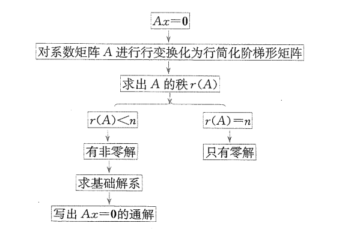
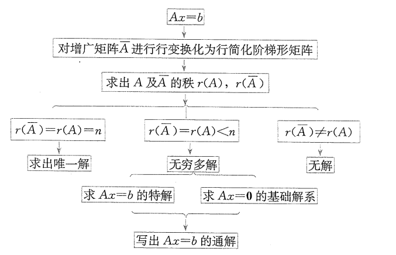

# 1. 线性方程组的表示法

## 1.1 一般形式

> 含有$n$个未知数，$m$个方程的线性方程组
>
> $\begin{cases} & a_{11}x_1 + a_{12}x_2 + \cdots + a_{1n}x_n = b_1 \\& a_{21}x_1 + a_{22}x_2 + \cdots + a_{2n}x_n = b_2 \\ & \cdots \cdots \\& a_{m1}x_1 + a_{m2}x_2 + \cdots + a_{mn}x_n = b_n \end{cases}$

- 系数矩阵$A = \begin{bmatrix} a_{11} & a_{12} & \cdots & a_{1n} \\ a_{21}&a_{22}& \cdots & a_{2n}\\\vdots & \vdots && \vdots \\ a_{m1} &a_{m2} & \cdots & a_{mn} \end{bmatrix}_{m \times n}$
- 增广矩阵$\overline{A} = \begin{bmatrix} a_{11} & a_{12} & \cdots & a_{1n}  & b_1\\ a_{21}&a_{22}& \cdots & a_{2n} & b_2\\\vdots & \vdots && \vdots & \vdots \\ a_{m1} &a_{m2} & \cdots & a_{mn}  & b_n\end{bmatrix} = (A, b)$
- 未知数列向量$x = \begin{bmatrix} x_1 \\ x_2 \\ \vdots \\ x_n \end{bmatrix}_{\textcolor{red}{n} \times 1}$
- 常数项列向量$b = x = \begin{bmatrix} b_1 \\ b_2 \\ \vdots \\ b_m \end{bmatrix}_{\textcolor{red}{m} \times 1}$

> 当常数项$b$均为$0$时，称为齐次线性方程组
>
> 当常数项$b$不全为$0$时，称为非齐次线性方程组

## 1.2 矩阵形式

> $Ax =b $

## 1.3 向量形式

> 将系数矩阵分为==列向量组==，$A = (\alpha_1, \alpha_2, \cdots, \alpha_n)$
>
> $\alpha_1x_1 + \alpha_2x_2 + \cdots+ \alpha_nx_n = b$

- 若使用向量形式表示齐次线性方程组，则向量组的组合系数即为方程组的解

# 2. 线性方程组解的判定

## 2.1 非齐次线性方程组的判定

> $n$元非齐次线性方程组有解的充分必要条件是，$r(A) = r(\overline{A})$
>
> 且当有解时
>
> - 若$r(A) = r(\overline{A}) = n$，有唯一解
> - 若$r(A) = r(\overline{A}) < n$，有无穷多解

- 进行初等行变换时只需对增广矩阵$\overline{A}$进行即可，因为去掉最后一列即为系数矩阵$A$的行阶梯矩阵

## 2.2 齐次线性方程组的判定

> 齐次线性方程组天然具有零解，判定的是在零解之外是否有非零解

> $n$元齐次线性方程组$Ax = 0$==有非零解==的充分必要条件是，系数矩阵$A$的秩小于未知数个数，即$r(A) < n$

> $n$元齐次线性方程组$Ax = 0$==只有零解==的充分必要条件是，系数矩阵$A$的秩等于未知数个数，即$r(A) = n$

- 推论
    1. 对于齐次线性方程组$Ax = 0$，如果方程的个数==小于==未知数的个数，则$Ax = 0$必有非零解
    2. 对于齐次线性方程组$Ax = 0$，如果方程的个数==等于==未知数的个数，即系数矩阵是方阵，则（即克莱姆法则）
        - $Ax = 0$有非零解$\Leftrightarrow |A|= 0$
        - $Ax = 0$只有零解$\Leftrightarrow |A|\ne 0$

# 3. 线性方程组解的性质

> 线性方程组的解，可以看成列向量，称为解向量，简称为解

## 3.1 齐次线性方程组的解的性质

1. 若$\xi_1, \xi_2$是齐次线性方程组$Ax=0$的两个解，则$\xi_1 + \xi_2$也是$Ax=0$的解

2. 若$\xi$是齐次线性方程组$Ax=0$的解，则对任意常数$k$，有$k\xi$也是$Ax=0$的解

3. 若$\xi_1, \xi_2,\cdots,\xi_s$是齐次线性方程组$Ax=0$的两个解，则

    $c_1\xi_1+c_2\xi_2+\cdots+c_s\xi_s,\;(c_1,c_2,\cdots,c_s\text{是任意常数})$也是$Ax=0$的解

## 3.2 非齐次线性方程组的解的性质

4. 设$\eta_1, \eta_2$是非齐次线性方程组$Ax=b$的任意两个解，则$\eta_1-\eta_2$为其对应导出组$Ax=0$的一个解
5. 设$\eta$是非齐次线性方程组$Ax=b$的解，$\xi$是其导出组$Ax=0$的任一解，则$\eta + \xi$是非齐次线性方程组$Ax=b$的一个解
6. 若$\eta^{\ast}$是$Ax=b$的一个解，则$Ax=b$的任一解可表示为$\xi+\eta^{\ast}$，其中$\xi$是其导出组$Ax=0$的解

# 4. 齐次线性方程组的基础解系

> 对于齐次线性方程组，引入了基础解系的概念
>
> 对于齐次线性方程组
>
> &emsp;$ \rightarrow$ 解向量的线性组合仍为方程组的解
>
> &emsp;&emsp;$\rightarrow$ 解向量组
>
> &emsp;&emsp;&emsp;$\rightarrow$ *<u>找到解向量组的极大线性无关组，即为基础解系</u>*

## 4.1 基础解系的定义

> 设$\xi_1, \xi_2,\cdots,\xi_s$是齐次线性方程组$Ax=0$的解向量，如果
>
> 1. $\xi_1, \xi_2,\cdots,\xi_s$线性无关（意味着没有零向量！）
> 2. 方程组$Ax=0$的任一解向量都可由$\xi_1, \xi_2,\cdots,\xi_s$线性表示
>
> 则称，$\xi_1, \xi_2,\cdots,\xi_s$是齐次线性方程组$Ax=0$的一个基础解系

- 显然，若方程组$Ax=0$只有零解，则没有基础解系

## 4.2 基础解系的存在及判定

- 存在性

    - 若$Ax=0$有非零解，则基础解系必存在

    - > 对于$n$元齐次线性方程组$Ax=0$，若$r(A) = r < n$，则$Ax=0$必存在基础解系，且基础解系中含有$n-r$个向量

    - 可以得到如下结论
        - $Ax=0$的基础解系存在$\Leftrightarrow$$Ax=0$存在非零解$\Leftrightarrow r(A) < n$

- 判定

    > 当下列三条同时成立时，可以说，$\xi_1, \xi_2,\cdots,\xi_s$是$n$元齐次线性方程组$Ax=0$的一个基础解系

    1. $\xi_1, \xi_2,\cdots,\xi_s$是$Ax=0$的解向量
    2. $\xi_1, \xi_2,\cdots,\xi_s$线性无关
    3. 两个选一个即可
        1. 方程组$Ax=0$的任一解向量都可由$\xi_1, \xi_2,\cdots,\xi_s$线性表示
        2. 向量组$\xi_1, \xi_2,\cdots,\xi_s$中的向量个数$s = n - r(A)$

## 4.3 基础解系的性质和结论

- 基础解系$\Leftrightarrow$解向量组的极大线性无关组，因此，基础解系具备极大线性无关组的相关性质和结论
    1. 当$Ax=0$有非零解时，基础解系存在
    2. 若$Ax=0$的基础解系存在，则基础解系不唯一
    3. $Ax=0$的不同基础解系之间可以互相线性表示
    4. $Ax=0$的不同基础解系所含向量个数相等，均为$n-r(A)$
    5. $Ax=0$的任意$n-r(A)$个线性无关的解向量都是它的基础解系
    6. 若$\xi_1, \xi_2,\cdots,\xi_s$是$Ax=0$的一个基础解系，则$Ax=0$的任一解都可以用$\xi_1, \xi_2,\cdots,\xi_s$线性表示

## 4.4 基础解系的求法

1. 对方程组的系数矩阵$A$进行初等行变换，化为行简化阶梯矩阵$B$
2. 以$B$为系数矩阵，写出同解方程$Bx = 0$
3. 确定自由未知量，通过自由未知量的特定取值，求出基础解系
    - 自由未知量个数为$n-r(A)$
    - 自由未知量的取值随意，但一般选择标准化的取值，即确定一个自由变量为$1$，其他为$0$

# 5. 线性方程组解的结构

## 5.1 齐次线性方程组解的结构

> 对于$n$元齐次线性方程组$Ax = 0$，若系数矩阵$A$的秩$r(A)=r < n$，$\xi_1, \xi_2,\cdots, \xi_{n-r}$为其一个基础解系，则方程组$Ax = 0$的通解可表示为
>
> $x = c_1\xi_1+c_2\xi_2+\cdots+c_{n-r}\xi_{n-r}$
>
> 其中，$c_1,c_2,\cdots,c_{n-r}$为任意常数

## 5.2 非齐次线性方程组解的结构

> 对于$n$元非齐次线性方程组$Ax = b$，若$r(A)= r(\overline{A}) = r < n$，如果$\alpha_0$是$Ax=b$的一个解（通常称为特解），$\xi_1, \xi_2,\cdots, \xi_{n-r}$为其导出组$Ax= 0$的一个基础解系，则方程组$Ax = b$的通解可表示为
>
> $x = \alpha_0 + c_1\xi_1+c_2\xi_2+\cdots+c_{n-r}\xi_{n-r}$
>
> 其中，$c_1,c_2,\cdots,c_{n-r}$为任意常数

# 6. 线性方程组的求解

## 6.1 齐次线性方程组的求解

1. 对系数矩阵进行初等行变换，化为行简化阶梯矩阵，求出系数矩阵的秩
2. 判断秩，若为$n$，则只有零解，不为$n$，则有非零解，求出基础解系
3. 根据解的结构，写出方程组的通解

## 6.2 非齐次线性方程组的求解

1. 对增广矩阵$\overline{A}$进行初等行变换，化为行简化阶梯矩阵，求出系数矩阵和增广矩阵的秩，判断是否有解，及解的个数
2. 有解时，以行简化阶梯矩阵为增广矩阵，写出新的同解线性方程组，求出一个特解
3. 求出导出组的一个基础解系
4. 写出原方程组的一个通解

# 7. 线性方程组的公共解

