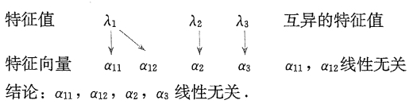

# 1. 特征值与特征向量的定义和关系

## 1.1 特征值和特征向量的定义

> 设$A$为$n$阶==方阵==，$\alpha$为$n$维==非零列向量==，$\lambda$为数，若$A\alpha = \lambda \alpha$，则称$\lambda$为方阵$A$的特征值，$\alpha$为方阵$A$的对应于特征值$\lambda$的特征向量

- 矩阵$A$必须是方阵，否则等号两边矩阵乘积后的矩阵形状不同
- 特征值$\lambda$是一个数，可能为$0$
- 特征向量$\alpha$是==非零====列==向量

## 1.2 特征值和特征向量的关系

1. 一个特征值可以对应多个特征向量

    > 若$\alpha$是矩阵$A$对应特征值$\lambda$的特征向量，则$k\alpha\; (k \ne 0)$也是矩阵$A$对应特征值$\lambda$的特征向量

    > 给定方阵$A$，若$\alpha_1, \alpha_2$都是对应于特征值$\lambda$的特征向量，则$k_1\alpha_1 + k_2\alpha_2 \ne 0$也是对应于特征值$\lambda$的特征向量

2. 一个特征向量只能对应于一个特征值

    > 给定方阵$A$，特征向量$\alpha$只能属于一个特征值

# 2. 特征值与特征向量的性质

1. $n$阶方阵$A$在复数域内必有$n$个特征值

2. $n$阶矩阵$A$与其转置矩阵$A^T$有相同的特征多项式，进而有相同的特征值，但特征向量一般不同

3. 设$n$阶矩阵$A$的$n$个特征值为$\lambda_1,\lambda_2,\cdots,\lambda_n$，则

    1. $\lambda_1 + \lambda_2 +\cdots+\lambda_n = a_{11}+ a_{22} + \cdots +a_{nn}$，其中$a_{11}+ a_{22} + \cdots +a_{nn}$记为$tr(A) = \displaystyle \sum_{i = 1}^n a_{ii}$，称为矩阵$A$的迹
    2. $\lambda_1\lambda_2\cdots\lambda_n = |A|$

4. 

    1. $n$阶矩阵$A$可逆$\xLeftrightarrow{\text{充要条件}}$$A$的所有特征值都不为$0$
    2. $n$阶矩阵$A$不可逆$\xLeftrightarrow{\text{充要条件}}$$A$的特征值至少有一个为$0$

5. 矩阵$A$的对应于不同特征值的特征向量线性无关

6. 矩阵$A$的对应于不同特征值的线性无关的特征向量，合起来得到的特征向量组仍线性无关

    

7.  

    1. 若$\lambda$是矩阵$A$的$k$重特征值，则$A$对应于特征值$\lambda$的线性无关的特征向量的个数不超过$k$个
    2. 若$\lambda$是$A$的单特征值，则$A$对应于特征值$\lambda$的线性无关的特征向量的个数有且只有$1$个
    3. $n$阶矩阵$A$线性无关的特征向量的个数最多为$n$

8. 若$\lambda$是矩阵$A$的特征值，对应的特征向量为$\alpha$，则

    |   矩阵   |    $A$    |    $A^m$    |    $kA$    |   $A +E$    |    $f(A)$    |      $A^2+2A + 3E$       |       $A^{-1}$        |       $A^{\ast}$        |
    | :------: | :-------: | :---------: | :--------: | :---------: | :----------: | :----------------------: | :-------------------: | :---------------------: |
    |  特征值  | $\lambda$ | $\lambda^m$ | $k\lambda$ | $\lambda+1$ | $f(\lambda)$ | $\lambda^2+2\lambda + 3$ | $\frac {1} {\lambda}$ | $\frac {|A|} {\lambda}$ |
    | 特征向量 | $\alpha$  |  $\alpha$   |  $\alpha$  |  $\alpha$   |   $\alpha$   |         $\alpha$         |       $\alpha$        |        $\alpha$         |

    - 推论

        > 若$\lambda$是矩阵$A$的特征值，$f(x)$为一多项式且$f(A) = 0$，则$f(\lambda) = 0$

9. 设矩阵$A = (a_{ij})_{n \times n}$且$r(A) = 1$，则$A$的特征值为$\lambda_1 = \displaystyle \sum_{i = 1}^{n}a_{ii}$，$\lambda_2 = \lambda_3 = \cdots = \lambda_n = 0$

# 3. 特征值与特征向量的求法

## 3.1 特征值的求法

> $A\alpha = \lambda \alpha \Rightarrow \lambda \alpha - A\alpha = 0 \Rightarrow (\lambda E - A)\alpha = 0$
>
> 因为$\alpha$为非零向量，所以$ (\lambda E - A)\alpha = 0$有非零解，需要$|\lambda E - A| = 0$
>
> 也即，求解特征值，就是求解$|\lambda E - A| = 0$

1. 基本概念

    - 特征矩阵：$\lambda E - A$

    - 特征多项式：$f(\lambda ) = |\lambda E - A| = \begin{vmatrix}  \lambda -\alpha_{11} & -\alpha_{12} & \cdots & -\alpha_{1n} \\  -\alpha_{21} & \lambda-\alpha_{22} & \cdots & -\alpha_{2n} \\ \vdots & \vdots   & \ddots & \vdots \\ -\alpha_{n1} & -\alpha_{n2} & \cdots & \lambda-\alpha_{nn} \end{vmatrix}$，也可称为特征行列式

    - 特征方程：$|\lambda E - A| = 0$

    - ==特征值，就是特征方程的根==
    - 单特征值：指的是特征值作为特征方程的解，在解中只出现一次
    - 重特征值：指的是特征值作为特征方程的解，在解中出现多次，出现几次就叫几重特征值

2. 求解特征值的步骤

    1. 写出特征矩阵$\lambda E - A$
        - 注意，$\lambda$只在主对角线出现，$A$的各个元素取相反数
    2. 写出特征多项式$|\lambda E - A| $
    3. 解特征方程$|\lambda E - A| = 0$
        1. $A$为$2$阶矩阵，可直接计算
        2. $A$为对角形，上/下三角形矩阵，也可直接计算
        3. 特征行列式$|\lambda E-A|$的零元素较多，按某一行/列展开
        4. 特征行列式$|\lambda E-A|$的行和/列和相等
        5. 特征行列式$|\lambda E-A|$中有对应相等或者为相反数，可抵消

## 3.2 特征向量的求法

> 求特征向量，就是求齐次线性方程组$(\lambda E - A)x = 0$的非零解，其中$x$表示的解向量就是$\alpha$

# 4. 相似矩阵的概念和性质

## 4.1 相似矩阵的概念

> 设$A$和$B$都是$n$阶方阵，若存在可逆矩阵$P$，使得$P^{-1}AP = B$，则称$A$与$B$相似，或称$B$是$A$的相似矩阵，记为$A \sim B$

> 特别的，如果矩阵$A$能与对角矩阵相似，则称$A$可==对角化==

- 相似矩阵的前提是同阶方阵
- 单位矩阵$E$和数量矩阵$kE$只能与自己相似

## 4.2 相似矩阵的性质

1. 相似的矩阵必等价，即$ A \sim B \Rightarrow A \cong B$

    - 注意，反之==不==成立，即$A \cong B \textcolor{red}{\not \Rightarrow} A \sim B$

    - 进而可知，相似矩阵具有等价矩阵的三个性质
        - 反身性 $A \sim A$
        
        - 对称性 若$A \sim B$，则$B \sim A$
        
        - 传递性 若$A \sim B, B \sim C$， 则$A \sim C$
        
    - 常用运算表达式

        - $P^{-1}ABP = P^{-1}AEBP = P^{-1}A(PP^{-1})BP = (P^{-1}AP)(P^{-1}BP)$
        - $P^{-1}(kA+lB)P = (P^{-1}kA + P^{-1}lB)P = kP^{-1}AP + lP^{-1}BP$，其中$k,l$为任意常数

2. 若$A \sim B$，则

    1. $r(A) = r(B)$
        - 相似矩阵必等价， 等价矩阵有相同的秩
    2. $A$与$B$有相同的特征行列式，即$|\lambda E -A| = |\lambda E -B|$，进而有相同的特征值
        - 逆命题==不==成立，不能说有相同特征值的两个矩阵相似
    3. $|A| = |B|$，$tr(A) = tr(B)$
        - 通过第二点可证
    4. $|A|$和$|B|$同时为$0$，或同时不为$0$，且同时可逆或不可逆
    5. 当$A,B$均可逆时，有$A^{-1} \sim B^{-1}$，$A^{\ast} \sim B^{\ast}$
    6. $A^m \sim B^m$，其中$m$为正整数
    7. $A^T \sim B^T$
    8. $kA \sim kB,\;\;A+kE \sim B+kE\;\; f(A) \sim f(B)$，其中$k$为常数，$f(x)$是关于$x$的多项式

# 5. 矩阵的对角化

> 可以通过判断矩阵是否可以对角化，使用对角矩阵研究原矩阵的一些性质
>
> - 如何判断是否可以对角化
> - 若可以对角化，求可逆矩阵$P$
> - 求对角矩阵$\Lambda$

## 5.1 矩阵与对角矩阵相似的条件

> $n$阶矩阵$A$可对角化$\Leftrightarrow$$A$有$n$个线性无关的特征向量

> 若$n$阶矩阵$A$有$n$个互异的特征值，则$A$可对角化

> $n$阶矩阵$A$可对角化
>
> $\Leftrightarrow$ $A$的每个重特征根对应的线性无关的特征向量的个数恰好等于该特征值的重数
>
> $\Leftrightarrow$ 对于$A$的任一$s$重特征值$\lambda$，齐次线性方程组$(\lambda E -A)x = 0$的基础解系含有$s$个向量
>
> $\Leftrightarrow$ 对于$A$的任一$s$重特征值$\lambda$，有$n - r(\lambda E -A) = s$
>
> $\Leftrightarrow$ 对于$A$的任一$s$重特征值$\lambda$，有$r(\lambda E -A) = n -s$

- 判断$A$能否相似于对角形矩阵，以三阶矩阵为例
    1. $3$阶方阵$A$，有$3$个互异的特征值，必可对角化
    2. $3$阶方阵$A$，有二重根$\lambda_1, \lambda_2$和单根$\lambda_3$
        - 对于二重根$\lambda_1, \lambda_2$，若($\lambda_1 E - A)x = 0$的基础解系中有==$2$==个线性无关的特征向量，则==可以==对角化
        - 对于二重根$\lambda_1, \lambda_2$，若($\lambda_1 E - A)x = 0$的基础解系中有==$1$==个线性无关的特征向量，则==无法==对角化
    3. $3$阶方阵$A$，有三重跟$\lambda_1=\lambda_2=\lambda_3$
        - ($\lambda_1 E - A)x = 0$的基础解系中有==$3$==个线性无关的特征向量，则==可以==对角化
        - ($\lambda_1 E - A)x = 0$的基础解系中有==$2$==个线性无关的特征向量，则==无法==对角化
        - ($\lambda_1 E - A)x = 0$的基础解系中有==$1$==个线性无关的特征向量，则==无法==对角化

## 5.2 可逆矩阵$P$及对角矩阵$\Lambda$的求法

1. 求出$A$的全部特征值$\lambda_1, \lambda_2,\cdots, \lambda_t$
2. 对每一个特征值$\lambda_i$，设其重数为$s_i$，则对应其次线性方程组$(\lambda_iE -A)x = 0$的基础解系，有$s_i$个向量$\xi_1,\xi_2,\cdots,\xi_{s_i}$组成，即$\xi_1,\xi_2,\cdots,\xi_{s_i}$为$\lambda_i$对应的线性无关的特征向量
3. 令$P = (\xi_{11},\xi_{12},\cdots,\xi_{1s_1},\; \xi_{21},\xi_{22},\cdots,\xi_{2s_2},\; \cdots,\;\xi_{i1},\xi_{i2},\cdots,\xi_{is_i})$，则$P$为可逆矩阵
4. $P^{-1}AP = \begin{bmatrix} \lambda_1 \\ & \ddots \\ &&\lambda_1 \\ &&&\lambda_2 \\ &&&& \ddots \\&&&&& \lambda_2 \\ &&&&&& \ddots \\ &&&&&&& \lambda_t \\ &&&&&&&& \ddots \\ &&&&&&&&& \lambda_t \end{bmatrix}$ 

> 其中$\xi_{i1},\xi_{i2},\cdots,\xi_{is_i}$要和$\lambda_i$一一对应

## 5.1 矩阵对角化应用-反求矩阵$A$及$A$的高次幂

> 若矩阵$A$可对角化，则存在可逆矩阵$P$及对角矩阵$\Lambda$，有$P^{-1}AP = \Lambda$
>
> 进而有：
>
> - $A = P\Lambda P^{-1}$
> - $A^m = P \Lambda^{m} P^{-1}$

# 6. 向量的内积

## 6.1 向量内积

> $n$维列向量$\alpha = \begin{bmatrix} x_1 \\ x_2 \\ \vdots \\x_n \end{bmatrix},\beta = \begin{bmatrix} y_1 \\ y_2 \\ \vdots \\y_n \end{bmatrix}$的内积为，$(\alpha,\beta) = \alpha^T \beta = x_1y_1 + x_2y_2 + \cdots+ x_ny_n$ 

> $n$维行向量 $\alpha = \begin{bmatrix} x_1 & x_2 & \cdots &x_n \end{bmatrix},\beta = \begin{bmatrix} y_1 & y_2 & \cdots &y_n \end{bmatrix}$的内积为
>
> $(\alpha,\beta) = \alpha \beta^T = x_1y_1 + x_2y_2 + \cdots+ x_ny_n$  

- 性质
    1. 非负性： $(\alpha, \alpha) \ge 0$，且若$(\alpha, \alpha) = 0$，则有$\alpha = 0$
    2. 对称性：$(\alpha, \beta) = (\beta, \alpha)$
    3. 齐次性：$(k\alpha, \beta) = k(\alpha,\beta)$
    4. 分配性：
        1. $(\alpha_1 + \alpha_2, \beta) = (\alpha_1, \beta) + (\alpha_2, \beta)$
        2. $(\alpha, \beta_1+\beta_2) = (\alpha, \beta_1) + (\alpha, \beta_2)$
        3. $(\alpha_1 + \alpha_2, \beta_1+\beta_2) = (\alpha_1, \beta_1) + (\alpha_1, \beta_2) + (\alpha_2, \beta_1) + (\alpha_2, \beta_2)$

## 6.2 长度

> 设$\alpha = (x_1, x_2, \cdots, x_n)$，则称$\|\alpha\| = \sqrt{(\alpha, \alpha)}= \sqrt{x_1^2+x_2^2+\cdots + x_n^2}$为$\alpha$的长度，或称为模，范数

- 特别的，长度为$1$的向量称为单位向量

    - 设$\alpha$为$n$维单位列向量，则$\alpha^T\alpha = 1$

- 向量$\alpha$的单位化

    > 在$R^n$中任一非零向量$\alpha$，令$\beta = \frac {1} {\|\alpha\|} \alpha$，则$\beta$为一单位向量，该过程称为向量$\alpha$的单位化

- 性质

    - 非负性：$\|\alpha\| \ge 0$，且$\|\alpha\|=0 \Leftrightarrow \alpha = 0$
    - 齐次性：$\|k\alpha\| = |k| \cdot\|\alpha\|$
    - 三角不等式：$\|\alpha + \beta\| \le \|\alpha\| + \|\beta\|$
    - 柯西-施瓦茨不等式
        - $|(\alpha, \beta)| \le \|\alpha\| \cdot \|\beta\|$
            - 等号成立时，$\alpha$和$\beta$线性相关，也即$\alpha = k\beta$
        - 向量的内积，可以表示为$(\alpha, \beta) = \|\alpha\|\cdot\|\beta\|\cdot cos\theta$，其中$\theta$是$\alpha,\beta$的夹角
        - 几何意义：
            - 两个向量的内积的绝对值不会超过它们长度的乘积。等号成立时，两个向量方向相同或相反

> 当$\alpha \ne 0, \beta \ne 0$，称$\theta = arccos\frac {(\alpha,\beta)} {\|\alpha\|\cdot \|\beta\|}\;(0 \le \theta \le \pi)$为向量$\alpha$与$\beta$的夹角

- 规定：零向量与任意向量的夹角为$\frac {\pi} {2}$

> 当夹角$\theta = \frac {\pi} {2} \Rightarrow cos\theta = 0 \Rightarrow (\alpha, \beta) = 0$时，称向量$\alpha$与$\beta$正交或垂直

## 6.3 正交

- 向量正交

    > 若向量$\alpha$和向量$\beta$的内积为$0$，即$(\alpha, \beta) = 0$，则称向量$\beta$与$\beta$正交，记作$\alpha \perp \beta$

    - 零向量与任意向量都正交
    - *<u>只有零向量与本身正交</u>*

- 正交向量组

    > ==两两正交==的==非零==向量组，称为正交向量组

    - 由==一个====零向量==，组成的向量组，是正交向量组

- 标准正交向量组

    > 每个向量均为==单位==向量的==正交向量组==，称为标准正交向量组，或单位正交向量组

- 性质

    > 正交向量组必线性无关，反之，无法确定线性无关的向量组是正交向量组

    ​	

- 施密特正交化方法

    - 目的：由一个线性无关的向量组，构造一个与其==等价==的正交向量组

    - 步骤

        - 设向量组$\alpha_1, \alpha_2, \cdots, \alpha_s$线性无关

        1. 正交化

            令

            - $\beta_1 = \alpha_1$
            - $\beta_2 = \alpha_2 - \frac {(\alpha_2, \beta_1)}{(\beta_1, \beta_1)} \beta_1$
            - $\beta_3= \alpha_3 - \frac {(\alpha_3, \beta_1)}{(\beta_1,\beta_1)} \beta_1 - \frac {(\alpha_3, \beta_2)}{(\beta_2, \beta_2)} \beta_2$
            - $\cdots\cdots$
            - $\beta_s = \alpha_s - \frac {(\alpha_s, \beta_1)}{(\beta_1, \beta_1)} \beta_1 - \frac {(\alpha_s, \beta_2)}{(\beta_2, \beta_2)} \beta_2 - \cdots - \frac{(\alpha_s, \beta_{s-1})}{(\beta_{s-1}, \beta_{s-1})} \beta_{s-1}$

            > 则$\beta_1, \beta_2, \cdots, \beta_s$是与$\alpha_1, \alpha_2, \cdots, \alpha_s$等价的正交向量组

        2. 单位化

            令

            - $\gamma_1 = \frac {\beta_1} {\|\beta_1\|}$
            - $\gamma_2 = \frac {\beta_2} {\|\beta_2\|}$
            - $\gamma_3 = \frac {\beta_3} {\|\beta_3\|}$
            - $\cdots \cdots$
            - $\gamma_s = \frac {\beta_s} {\|\beta_s\|}$

            > 则$\gamma_1, \gamma_2, \cdots, \gamma_s$是与$\alpha_1, \alpha_2, \cdots, \alpha_s$等价的标准正交向量组

## 6.4 正交矩阵

> 满足$A\cdot A^T=E$的$n$阶矩阵$A$称为正交矩阵

- 性质

    1. 若$A$为正交矩阵，则有
        1. $A \cdot A^T = A^T \cdot A = E$
        2. $|A| = \pm 1$
        3. $A$可逆，且$A^{-1} = A^T$
        4. $A^T, A^{-1}, A^{\ast}$均为正交矩阵
        5. $A$的行向量组，列向量组均为标准正交向量组

    2. 若$\lambda$是正交矩阵$A$的特征值，则$\frac {1}{\lambda}$也是其特征值
    3. 若$A, B$均为正交矩阵，则$AB$也为正交矩阵
    4. 保内积性
        - 若$A$为正交矩阵，则$(A\alpha, A\beta) = (\alpha, \beta)$
    5. 保长度性
        - 若$A$为正交矩阵，则$\|A\alpha\| = \|\alpha\|$

# 7. 实对称矩阵的对角化

> 实对称矩阵一定可以对角化，对角化指的是存在可逆矩阵$P$，使得$P^{-1}AP =\Lambda$，其中$\Lambda$为对角矩阵

## 7.1 实对称矩阵的概念和性质

- 正交相似

    > 设$A, B$为两个$n$阶方阵，如果存在一个正交矩阵$Q$，使得$Q^{-1}AQ =B$，则称$A, B$正交相似

    - 正交相似的两个矩阵必定相似，反之不成立
    - 定义可改为$Q^TAQ=B$，因为$Q$是正交矩阵，有$Q^T = Q^{-1}$
    - 若$A,B$正交相似，且$A$为对称矩阵，则$B$也是对称矩阵

- 实对称矩阵

    > 所有元素均为实数的对称矩阵，称为实对称矩阵

    - 实对称矩阵的特征值和特征向量的独有性质
        1. 实对称矩阵的特征值均为实数，特征向量均为实向量
        2. 实对称矩阵的，对应于不同特征值的特征向量正交
        3. 设$A$为$n$阶实对称矩阵，则对于$A$的任一$s$重特征值$\lambda$，有$r(\lambda E -A) = n -s$
        4. 实对称矩阵对应于$s$重特征值的线性无关的特征向量恰有$s$个
        5. $n$阶实对称矩阵必有$n$个线性无关的特征向量
        6. 实对称矩阵一定可以对角化
        7. 实对称矩阵与对角矩阵正交相似

## 7.2 实对称矩阵的对角化

1. 求解特征值
    - 由$|\lambda E -A| = 0$，得到$A$的全部特征值$\lambda_1, \lambda_2, \cdots, \lambda_n$
2. 求解特征向量
    - 对特征值$\lambda_i$，解齐次线性方程组$(\lambda_iE-A)x = 0$，得到$n$个线性无关的特征向量$\alpha_1,\alpha_2,\cdots,\alpha_n$
3. 构造可逆矩阵及对角矩阵
    1. 使用可逆矩阵，直接构造$P = (\alpha_1,\alpha_2,\cdots,\alpha_n)$，则$P^{-1}AP = \Lambda$
    2. 使用正交矩阵
        1. 正交化：将特征向量$\alpha_1,\alpha_2,\cdots,\alpha_n$正交化得到$\beta_1,\beta_2,\cdots,\beta_n$
            - 如果特征向量已经正交，则不需要额外的正交化步骤，否则需要正交化
        2. 单位化：将正交化向量组$\beta_1,\beta_2,\cdots,\beta_n$单位化得到$\gamma_1,\gamma_2,\cdots, \gamma_n$，则正交矩阵$Q = (\gamma_1,\gamma_2,\cdots, \gamma_n)$，有$Q^{-1}AQ=\Lambda$ 
