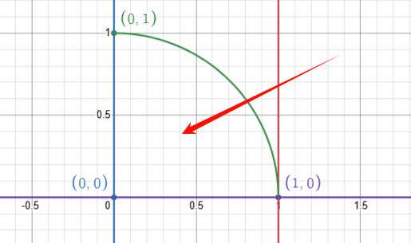
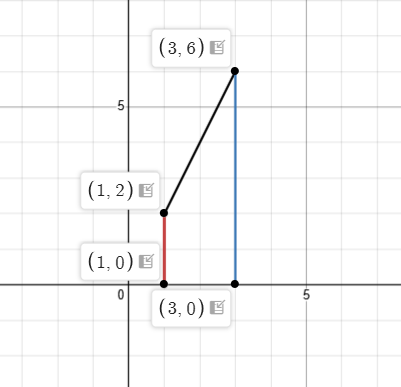
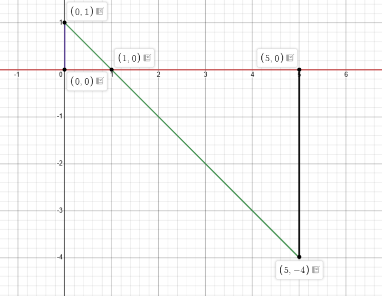
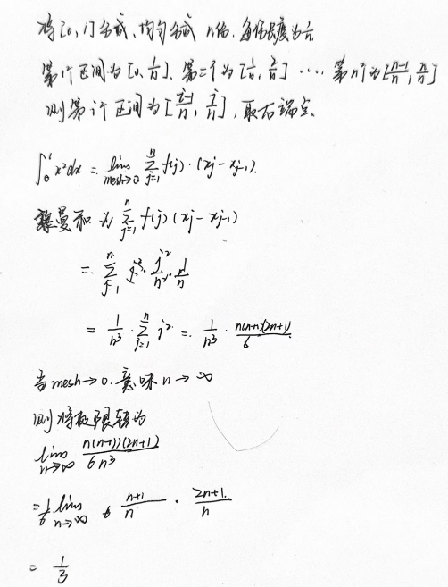

# 1. 定积分
1. 使用面积计算定积分的值
   1. 由$y=\sqrt{1-x^2}$，$x$轴，$x=0$和$x=1$围成的四分之一圆的面积，积分值为$\frac {\pi} 4$

       

   2. 由$y=2x$，$x$轴，$x=1$，$x=3$围成的梯形的面积，积分值为$8$

       

   3. 由$y=1-x$，$x$轴，$x=0$，$x=5$围成的两个等腰三角形的面积之差，$x$轴下方三角形面积为负，积分值为$-\frac {15} 2$

       

2. 使用黎曼和求解定积分$\displaystyle \int_0^1x^2dx$

    

# 2. 定积分基本性质

